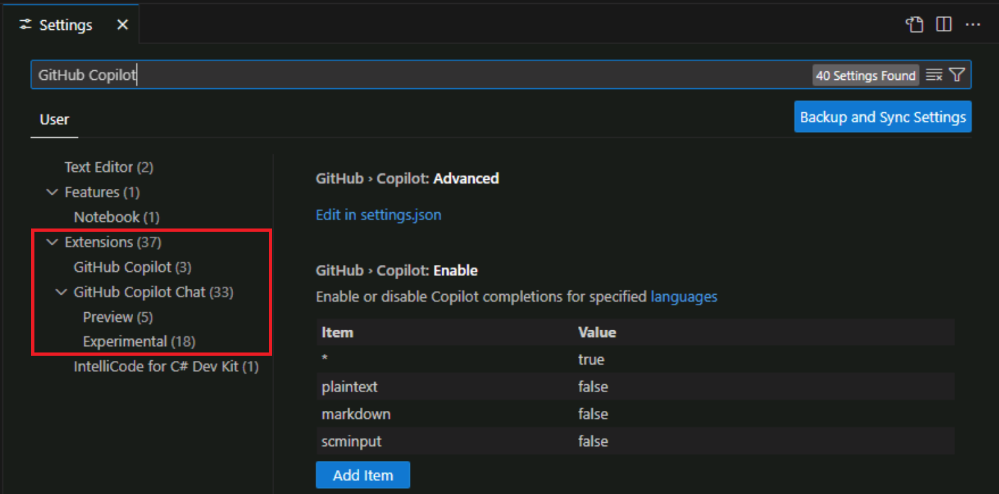
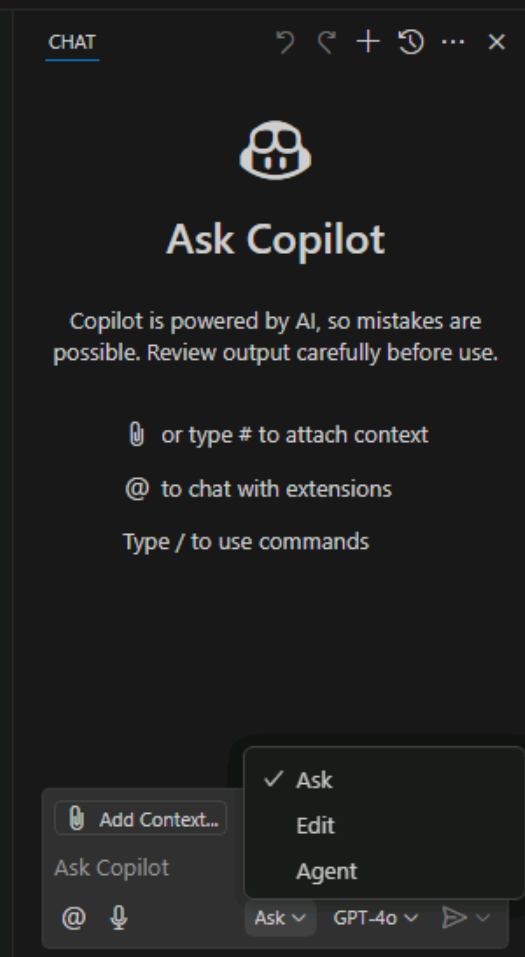

---
lab:
  title: 'Ejercicio: Examen de la configuración de GitHub Copilot y las características de la interfaz de usuario'
  description: "Obtenga información sobre cómo configurar las opciones de GitHub\_Copilot y cómo acceder a las características de GitHub\_Copilot en Visual\_Studio Code."
---

# Examen de la configuración de GitHub Copilot y las características de la interfaz de usuario

Visual Studio Code proporciona una experiencia de GitHub Copilot perfecta y personalizable para los desarrolladores. En este ejercicio, examinará la configuración de GitHub Copilot y explorará la interfaz de usuario de GitHub Copilot en Visual Studio Code.

Este ejercicio debe tardar aproximadamente **25** minutos en completarse.

> **IMPORTANTE**: Para completar este ejercicio, debe proporcionar su propia cuenta de GitHub y suscripción de GitHub Copilot. Si no tiene una cuenta de GitHub, puede <a href="https://github.com/" target="_blank">registrarse</a> para obtener una cuenta individual gratuita y usar un plan gratuito de GitHub Copilot para completar el ejercicio. Si tiene acceso a una suscripción de GitHub Copilot Pro, GitHub Copilot Pro+, GitHub Copilot Business o GitHub Copilot Enterprise desde el entorno de laboratorio, puede usar la suscripción de GitHub Copilot existente para completar este ejercicio.

## Antes de comenzar

El entorno de laboratorio debe incluir lo siguiente:

- Git 2.48 o posterior
- .NET o Python:

    - **SDK de .NET 9.0** o posterior con Visual Studio Code con la extensión **Kir de desarrollo de C#**.
    - **Python 3.10** o posterior con Visual Studio Code con la extensión **Python**

- Una cuenta de GitHub con acciones de GitHub Copilot habilitadas.

Si usa un equipo local como entorno de laboratorio para este ejercicio:

- Si necesita ayuda para configurar el equipo local como entorno de laboratorio, abra el vínculo siguiente en un explorador: <a href="https://go.microsoft.com/fwlink/?linkid=2320147" target="_blank">Configuración de los recursos del entorno de laboratorio</a>.

- Si necesita ayuda para habilitar la suscripción de GitHub Copilot en Visual Studio Code, abra el vínculo siguiente en un explorador: <a href="https://go.microsoft.com/fwlink/?linkid=2320158" target="_blank">Habilitación de GitHub Copilot en Visual Studio Code</a>.

Si usa un entorno de laboratorio hospedado para este ejercicio:

- Si necesita ayuda para habilitar la suscripción de GitHub Copilot en Visual Studio Code, pegue la siguiente dirección URL en la barra de navegación del sitio de un explorador: <a href="https://go.microsoft.com/fwlink/?linkid=2320158" target="_blank">Habilitación de GitHub Copilot en Visual Studio Code</a>.

- Para asegurarse de que el SDK de .NET está configurado para usar el repositorio oficial de NuGet.org como origen para descargar y restaurar paquetes:

    Abra un terminal de comandos y luego ejecute los siguientes comandos:

    ```bash

    dotnet nuget add source https://api.nuget.org/v3/index.json -n nuget.org

    ```

- Para configurar el entorno de laboratorio hospedado para Python, siga estos pasos:

    1. Para determinar la versión de Python instalada en el entorno hospedado, ejecute el siguiente comando:

        ```bash
        python --version
        ```

        Si es necesario, siga estos pasos en la siguiente dirección URL para configurar Python en Visual Studio Code: <a href="https://code.visualstudio.com/docs/python/python-tutorial" target="_blank">Introducción a Python en VS Code</a>.

    1. Para instalar la extensión, seleccione la vista Extensiones en Visual Studio Code.

## Escenario del ejercicio

Es un desarrollador que trabaja en el departamento de TI de la comunidad local. Los sistemas de back-end que admiten la biblioteca pública se han perdido en un incendio. El equipo debe desarrollar una solución temporal para ayudar al personal de la biblioteca a administrar sus operaciones hasta que se pueda reemplazar el sistema. El equipo ha elegido GitHub Copilot para acelerar el proceso de desarrollo.

Este ejercicio incluye las siguientes tareas:

1. Examine la configuración de GitHub Copilot en Visual Studio Code.
1. Explore la interfaz de usuario de GitHub Copilot en Visual Studio Code.

## Examine la configuración de GitHub Copilot en Visual Studio Code.

La configuración de GitHub Copilot se divide entre la cuenta de GitHub y el entorno de Visual Studio Code. En Visual Studio Code, la configuración le permite configurar el comportamiento de GitHub Copilot y GitHub Copilot Chat. En la cuenta de GitHub, la configuración le permite administrar la suscripción de GitHub Copilot, configurar la retención de mensajes y sugerencias, y permitir o bloquear sugerencias que coincidan con el código público.

### Habilitación o deshabilitación de GitHub Copilot en Visual Studio Code

Las extensiones de GitHub Copilot en Visual Studio Code están habilitadas de forma predeterminada cuando se activa un plan. Sin embargo, puede deshabilitar GitHub Copilot en Visual Studio Code durante un período de tiempo si es necesario.

Completa los siguientes pasos para usar esta sección del ejercicio:

1. Abra una nueva instancia de Visual Studio Code.

1. En Visual Studio Code, abra la vista **Extensiones**.

1. En la lista de extensiones instaladas, desplácese hacia abajo hasta que encuentre **GitHub Copilot**.

1. Para mostrar un menú desplegable de la extensión GitHub Copilot que incluye las opciones Habilitar y Deshabilitar, seleccione el icono de engranaje de la extensión GitHub Copilot.

    

Si desea probar las opciones de habilitar o deshabilitar, puede seleccionar la opción de deshabilitar. No obstante, asegúrese de volver a activar GitHub Copilot antes de continuar con este ejercicio.

### Examen de la configuración de las extensiones de GitHub Copilot

Los valores predeterminados se configuran automáticamente al activar GitHub Copilot en Visual Studio Code. La configuración se organiza bajo la etiqueta Extensiones, que incluye la configuración para GitHub Copilot y GitHub Copilot Chat. Puede personalizar la configuración de las extensiones de GitHub Copilot mediante la pestaña de configuración de Visual Studio Code.

> **SUGERENCIA**: Puede usar el menú Copilot Chat para abrir una pestaña Configuración filtrada para GitHub Copilot.

Completa los siguientes pasos para usar esta sección del ejercicio:

1. En la barra de menús superior de Visual Studio Code, abra el menú Copilot Chat.

    El menú Copilot Chat incluye una opción **Configurar finalizaciones de código** que proporciona acceso a una lista filtrada de ajustes de GitHub Copilot.

    

1. En el menú Copilot Chat, seleccione **Configurar finalizaciones de código** y, a continuación, seleccione **Editar configuración**.

1. Dedique un momento a revisar cómo se organiza la configuración de GitHub Copilot.

    

    Tenga en cuenta que la configuración de *GitHub Copilot* y *GitHub Copilot Chat* están separadas. Observe también las categorías *Versión preliminar* y *Experimental*.

1. En la etiqueta Extensiones, seleccione **GitHub Copilot**.
  
    

    Tenga en cuenta que la lista de configuración ahora está filtrada solo para GitHub Copilot.

    La configuración de GitHub Copilot incluye las siguientes opciones:

    - **GitHub.Copilot.Advanced**: configure opciones avanzadas para GitHub Copilot en settings.json.

        Al seleccionar **Editar en settings.json** se abre el archivo settings.json, que es un archivo JSON que contiene la configuración de GitHub Copilot. La configuración se organiza en secciones y cada sección contiene una lista de opciones de configuración.

        

    - **GitHub.Copilot.Enable**: habilite o deshabilite las finalizaciones de Copilot para los lenguajes especificados.

        El término *lenguajes* se refiere a los lenguajes de programación, pero también admite otros formatos de archivo. Los lenguajes se especifican utilizando una lista de lenguajes y un valor de **true** o **false** para habilitar o deshabilitar GitHub Copilot para cada lenguaje. De forma predeterminada, GitHub Copilot está habilitado para todos los idiomas. Esta configuración se especifica con el carácter comodín **\*** en la primera fila y el valor **verdadero**. Las filas posteriores especifican los idiomas para los que GitHub Copilot está habilitado o deshabilitado. Por ejemplo, GitHub Copilot está habilitado para **C#**, **JavaScript** y **Python** y deshabilitado para **Plaintext** y **Markdown**.

        

    - **GitHub.Copilot.SelectedCompletionModel**: seleccione el modelo que se va a usar para las finalizaciones de Copilot.

        Para seleccionar un modelo de finalizaciones, abra el menú Configurar finalizaciones de Copilot y, a continuación, seleccione la opción de menú **Cambiar modelo de finalizaciones**.

        

        La lista de modelos puede estar limitada por la suscripción de GitHub Copilot, los modelos disponibles en su región y los modelos disponibles para su organización.

        

1. En **Habilitar o deshabilitar finalizaciones de Copilot para idiomas especificados**, seleccione **Markdown**.

    El valor predeterminado de Markdown se establece en **false**. Esto significa que las finalizaciones de GitHub Copilot están deshabilitadas para los archivos Markdown.

1. Para habilitar Copilot para archivos Markdown, seleccione **Editar elemento** (icono de lápiz), seleccione **falso**, cambie el valor a **verdadero** y luego seleccione **Aceptar**.

    Ahora puede usar GitHub Copilot para ayudarle a crear o actualizar archivos Markdown. Por ejemplo, GitHub Copilot puede generar sugerencias de finalización de código al trabajar en la documentación del proyecto.

1. En la etiqueta Extensiones, seleccione GitHub Copilot Chat.

    

    La extensión GitHub Copilot Chat tiene una larga lista de ajustes disponibles y se actualiza periódicamente. La extensión GitHub Copilot Chat también incluye ajustes preliminares y experimentales que están sujetos a cambios y podrían dejar de estar disponibles. La versión preliminar y la configuración experimental se incluyen al final de la lista y se etiquetan como **Versión preliminar** o **Experimental**.

    

1. Dedique unos minutos a revisar la configuración de GitHub Copilot Chat.

    Se recomienda mantener la configuración predeterminada durante este entrenamiento. Esto ayuda a garantizar que tiene la experiencia esperada al trabajar con los ejercicios. Cuando haya completado el entrenamiento, puede experimentar con esta configuración para personalizar su experiencia con GitHub Copilot y Copilot Chat.

1. Cierre la pestaña de configuración.

## Explore la interfaz de usuario de GitHub Copilot en Visual Studio Code.

Visual Studio Code integra perfectamente las características de IA de GitHub Copilot en el entorno de desarrollo.

Las características de GitHub Copilot se alinean con las siguientes categorías:

- Chat en lenguaje natural: GitHub Copilot proporciona tres interfaces de chat distintas: Vista de chat, Chat rápido y Chat insertado.

- Finalizaciones de código: GitHub Copilot se integra con el editor de código para generar sugerencias de finalización de código compatibles con el contexto a medida que escribe.

- Acciones inteligentes: GitHub Copilot automatiza tareas comunes con acciones inteligentes para eliminar la escritura repetitiva de indicaciones.

Las características de productividad de GitHub Copilot son fáciles de usar y se integran sin en el flujo de trabajo sin interrumpir la experiencia de codificación.

### Exploración de las características de la Vista de chat

Completa los siguientes pasos para usar esta sección del ejercicio:

1. Para abrir la Vista de chat, seleccione el botón **Alternar chat**.

    El botón Alternar chat se encuentra en la parte superior de la ventana de Visual Studio Code, justo a la derecha del cuadro de texto de búsqueda.

    

    De forma predeterminada, la Vista de chat se abre en la barra lateral secundaria del lado derecho de la ventana de Visual Studio Code.

1. Dedique unos minutos a examinar la interfaz de la Vista de chat.

    

    Comenzando desde la parte superior y descendiendo, la Vista de chat incluye los siguientes elementos de interfaz:

    - Barra de herramientas de vista de chat: La barra de herramientas Vista de chat se encuentra en la esquina superior derecha de la vista de chat. Puede usar la barra de herramientas para administrar el historial de chat, iniciar un nuevo chat, abrir la Vista de chat en otra ubicación u ocultar la Vista de chat. Pase el puntero del ratón por encima de los iconos de los botones de la barra de herramientas para ver una descripción.

    - Área de respuesta de chat: el área de respuesta de chat es el espacio situado debajo de la barra de herramientas de la vista Chat donde GitHub Copilot muestra las respuestas. Las respuestas incluyen sugerencias de código, explicaciones, elementos interactivos y otra información relacionada con la indicación.

    - Botón "Agregar contexto": el botón "Agregar contexto" se encuentra en la sección inferior de la vista Chat. Puede usar este botón para buscar recursos que añaden contexto a la Sesión de chat. Los recursos pueden ser cualquier cosa, desde archivos de proyecto internos a repositorios públicos en GitHub externos a la organización.

    - Preguntar a Copilot: el cuadro de texto "Pregúntale a Copilot" es donde se escriben las indicaciones. Puede usar el cuadro de texto Preguntar a Copilot para hacer preguntas de GitHub Copilot sobre el código base, solicitar sugerencias de código o pedir ayuda con tareas específicas.

    - Botón "Chat con extensión": el botón "Chat con extensión" se encuentra debajo del cuadro de texto "Pregúntale a Copilot". Las extensiones de GitHub Copilot son un tipo de aplicación de GitHub que integra la potencia de herramientas externas en GitHub Copilot Chat. Puede usar este botón para seleccionar una lista de extensiones de Copilot. Las extensiones predeterminadas proporcionan una combinación de participantes de chat y comandos de barra diagonal que proporcionan contexto para sus indicaciones.

        > **NOTA**: Cualquier persona con un plan Copilot Pro, Copilot Pro+ o Copilot Free puede usar extensiones de Copilot. En el caso de las organizaciones o empresas con un plan Copilot Business o Copilot Enterprise, los propietarios de la organización y los administradores de la empresa pueden conceder acceso a las extensiones de Copilot. Las extensiones de Copilot no están disponibles para GitHub Enterprise Server.

    - Botón "Iniciar chat de voz": el botón "Iniciar chat de voz" se encuentra debajo del cuadro de texto "Pregúntale a Copilot". Puede usar este botón para habilitar o deshabilitar las interacciones de voz con GitHub Copilot. Cuando se habilitan las interacciones de voz, puede usar la voz para formular preguntas de GitHub Copilot o solicitar sugerencias de código.

    - Menú "Modo chat": el menú desplegable "Modo chat" se encuentra a la derecha del botón "Iniciar chat de voz". En función de sus necesidades específicas, puede elegir entre diferentes modos de chat:

        - **Preguntar**: use este modo para hacer preguntas a GitHub Copilot sobre el código base. Puede pedirle a GitHub Copilot que explique el código, sugiera cambios o proporcione información sobre el código base.
        - **Editar**: use este modo para editar código en el área de trabajo. Puede usar GitHub Copilot para refactorizar el código, agregar comentarios o realizar otros cambios en el código.
        - **Agente**: use este modo para ejecutar GitHub Copilot como agente. Puede GitHub Copilot para ejecutar comandos, ejecutar código o realizar otras tareas en el área de trabajo.

    - Menú "Seleccionar modelo": el menú "Seleccionar modelo" se encuentra a la derecha del menú "Modo chat". Puede usar este botón para seleccionar el modelo que GitHub Copilot utiliza para generar sugerencias de código. El modo predeterminado es GPT-4o. Las selecciones de modelo pueden limitarse en función de la suscripción de GitHub Copilot, la configuración de GitHub Copilot y los modelos disponibles en su región.

    - Menú "Enviar y distribuir": el menú "Enviar y distribuir" se encuentra a la derecha del menú "Seleccionar modelo". Puede usar este botón para enviar el mensaje a GitHub Copilot y recibir una respuesta. El menú incluye varias opciones para enviar la indicación.

1. Use el cuadro de texto Preguntar a Copilot para escribir el mensaje siguiente y, a continuación, envíe el mensaje:

    **Para C#:**

    ```text
    Create a C# console app that prints Hello World to the console.
    ```

    **O para Python:**

    ```text
    Create a Python console app that prints Hello World to the console.
    ```

1. Tenga en cuenta que la respuesta de GitHub Copilot incluye una lista interactiva de archivos y un botón **Crear área de trabajo**.

1. Para que GitHub Copilot cree el proyecto de código, seleccione **Crear área de trabajo**.

    GitHub Copilot le pedirá una carpeta principal antes de crear el área de trabajo.

1. En el cuadro de diálogo Archivo, seleccione la carpeta **Escritorio** y, a continuación, seleccione **Seleccionar como carpeta principal**.

1. Cuando se le pida que abra el área de trabajo creada, seleccione **Abrir**.

    Se pueden usar avisos más avanzados para crear un área de trabajo con varios archivos o para crear diferentes tipos de proyecto. Por ejemplo, puede usar el siguiente mensaje para especificar condiciones adicionales para el proyecto de aplicación de consola:

    **Para C#:**

    ```text
    Create a C# console app that prints Hello World to the console. Include a .gitignore file.
    ```

    **O para Python:**

    ```text
    Create a Python console app that prints Hello World to the console. Include a .gitignore file.
    ```

### Exploración de las características de Chat rápido

La ventana Chat rápido es una interfaz simplificada para interactuar con GitHub Copilot. Proporciona una manera rápida de formular preguntas, solicitar sugerencias de código o obtener ayuda con tareas específicas sin salir del editor de código.

1. Abra el menú Copilot Chat y observe que aparecen tres opciones de Chat.

    

    Las tres opciones de menú son:

    - Abrir chat: esta opción se usa para abrir la vista Chat.

    - Chat insertado en el editor: esta opción se usa para interactuar con GitHub Copilot directamente en el editor de código. La opción Chat insertado solo está habilitada cuando hay un archivo abierto en el editor.

    - Chat rápido: esta opción se usa para interactuar con GitHub Copilot mediante una interfaz simplificada. Puede usar el chat rápido para formular preguntas, solicitar sugerencias de código u obtener ayuda con tareas específicas sin salir del editor de código.

1. En el menú Copilot Chat, seleccione **Chat rápido**.

    De forma predeterminada, la ventana Chat rápido se abre en el centro superior de la ventana de Visual Studio Code.

1. Tenga en cuenta que la ventana de Chat rápido ofrece muchas de las mismas opciones que la vista de Chat.

1. Use la ventana de Chat rápido para enviar el siguiente mensaje:

    ```text
    Tell me about the Program.cs file
    ```

    Sin contexto adicional, es probable que la respuesta sea una descripción de cómo se utilizan los archivos Program.cs en diversos tipos de proyectos.

1. Para agregar el archivo Program.cs al contexto de Chat rápido, arrastre y coloque el archivo Program.cs desde la vista Explorador a la parte superior de la ventana Chat rápido.

1. Observe que la ventana Chat rápido ahora incluye **Program.cs** a la derecha del botón **Agregar contexto**.

    > **SUGERENCIA**: La adición de archivos de proyecto al contexto de chat (vista Chat, Chat rápido o Chat insertado) ayuda a GitHub Copilot a proporcionar sugerencias más pertinentes. Al agregar archivos de proyecto al contexto de chat, a menudo es más fácil usar una operación de arrastrar y colocar en lugar del botón Agregar contexto.

1. Desplácese hasta la parte superior de la ventana Chat rápido y vuelva a enviar el mismo símbolo del sistema:

    ```text
    Tell me about the Program.cs file
    ```

1. Observe que la nueva respuesta describe el contenido del archivo de Program.cs en lugar de una descripción general de cómo se usan los archivos Program.cs.

1. En la esquina superior derecha de la ventana Chat rápido, seleccione **Abrir en la Vista de chat**.

    Observe que se cierra la ventana Chat rápido y la vista Chat se abre con respuestas que aparecieron en la ventana Chat rápido. Si la Vista de chat no muestra la sesión de Chat rápido, use el menú Copilot Chat para abrir la ventana Chat rápido y, a continuación, seleccione **Abrir en la Vista de chat**.

    Cambiar a la Vista de chat resulta útil cuando se necesita ampliar y gestionar una sesión de chat que se inició en la ventana de Chat rápido.

    > **SUGERENCIA**: La ventana "Chat rápido" es excelente para preguntas rápidas y tareas sencillas. Sin embargo, si desea un entorno de chat más dedicado, debe usar la Vista de chat. La Vista de chat ofrece una interfaz más completa para interactuar con GitHub Copilot e incluye funciones como el historial de chat, la gestión de archivos y opciones más avanzadas para gestionar las sesiones de chat.

### Exploración de las características de Chat insertado

La interfaz de Chat insertado está diseñada para interacciones de código directamente dentro del editor. Proporciona una experiencia más centrada y simplificada para trabajar con código, lo que le permite formular preguntas, solicitar sugerencias de código y realizar modificaciones sin salir del editor de código.

1. Abra el archivo Program.cs en el editor.

1. Abra el menú Copilot Chat y observe lo siguiente:

    - La opción del menú Chat insertado del editor ahora está habilitada.
    - El atajo de teclado **Ctrl+I** se puede utilizar para abrir una sesión de Chat insertado.

1. En el editor de código, seleccione el código siguiente:

    ```csharp

    namespace HelloWorldApp
    {
        class Program
        {
            static void Main(string[] args)
            {
                Console.WriteLine("Hello World");
            }
        }
    }

    ```

1. Para abrir una sesión de Chat insertado, use el método abreviado de teclado **Ctrl+I**.

1. Tómese un minuto para examinar la interfaz de Chat insertado.

    La interfaz de Chat insertado incluye algunas de las funciones que viste en las interfaces Vista de chat y Chat rápido, pero está diseñada para interacciones de código directamente dentro del editor.

1. Escriba el siguiente mensaje en el cuadro de texto Preguntar a Copilot y envíe el mensaje:

    ```text

    refactor using `namespace HelloWorldApp;`

    ```

1. Dedique un minuto a revisar la respuesta generada por el Chat insertado.

    

    Tenga en cuenta lo siguiente:

    - El Chat insertado genera una sugerencia actualizando el código directamente.
    - Puede seleccionar **Aceptar** para implementar la actualización sugerida, seleccionar **Cerrar** para rechazar la actualización seleccionada o seleccionar **Volver a ejecutar** para generar una nueva sugerencia.
    - También hay un menú **Más acciones** que proporciona opciones adicionales para administrar la sesión de Chat insertado, y puede calificar la sugerencia como "útil" o "no útil".

1. Para aceptar la actualización de código sugerida, seleccione **Aceptar**.

    El código se actualiza para usar la sintaxis del espacio de nombres con ámbito de archivo.

### Comparar los modos Preguntar y Editar de la Vista de chat

La vista Chat tiene tres modos: **Preguntar**, **Editar** y **Agente**. El modo Preguntar está diseñado para formular preguntas y generar sugerencias de código, mientras que el modo Editar está diseñado para tareas de refactorización y edición de código. El modo Agente está diseñado para ejecutar comandos y ejecutar código.

1. Asegúrese de que tiene abierta la Vista de chat en el modo **Preguntar**.

1. Seleccione el código siguiente:

    ```csharp

    static void Main(string[] args)
    {
        Console.WriteLine("Hello World");
    }

    ```

    Observe que el contexto de la Vista de chat se actualiza para especificar las líneas de código seleccionadas en el archivo Program.cs.

1. En la vista Chat, escriba el siguiente símbolo del sistema:

    ```text

    refactor selection to display "Generate equations for addition and subtraction:"

    ```

1. Dedique un minuto a revisar la respuesta mostrada en la Vista de chat.

    

    Observe que al mantener el puntero del mouse sobre el código, la Vista de chat muestra las siguientes opciones:

    - **Aplicar a Program.cs**: use esta opción para aplicar la actualización de código sugerida al archivo Program.cs.
    - **Insertar en cursor**: use esta opción para insertar la actualización de código sugerida en la posición actual del cursor en el editor.
    - **Copiar**: use esta opción para copiar la actualización de código sugerida en el Portapapeles.

1. En la vista Chat, seleccione **Establecer modo** y, después, **Editar**.

1. Si se muestra un mensaje que indica que cambiar el modo chat finaliza la sesión de chat actual, seleccione **Sí** para iniciar una nueva sesión de chat y, a continuación, vuelva a enviar el siguiente mensaje:

    ```text

    refactor selection to display "Generate equations for addition and subtraction:"

    ```

1. Dedique un minuto a revisar las actualizaciones sugeridas en el editor de código.

    

    Tenga en cuenta lo siguiente:

    - El editor de código muestra una vista *estilo diferencial* que muestra los cambios realizados en el código, similar a la vista Diferencial utilizada en las solicitudes de extracción de GitHub.
    - El editor de código muestra los botones **Aceptar** y **Deshacer**, que puede utilizar para aplicar o rechazar los cambios realizados en el código.
    - El editor de código muestra botones adicionales que se pueden usar para administrar las modificaciones sugeridas.

    Además de los controles de edición que se muestran en la pestaña del editor, la Vista de chat muestra un botón **Guardar** que puede utilizar para aplicar todas las ediciones y un botón **Deshacer** para cancelar las ediciones, así como una descripción abreviada de la actualización sugerida.

1. En la vista Chat, selecciona **Mantener** para aplicar las actualizaciones de código sugeridas.

> **NOTA**: El modo Agente de la vista Chat está diseñado para ejecutar tareas mediante un agente autónomo. Para conservar los recursos de GitHub Copilot, el modo agente no se usa en este ejercicio.

### Exploración de sugerencias de finalización de código

GitHub Copilot proporciona sugerencias de finalización de código basadas en el contexto del código en el editor. Puede usar sugerencias de finalización de código para generar rápidamente fragmentos de código, refactorizar código existente o implementar nuevas características.

1. Con el archivo Program.cs abierto en el editor de código, coloque el cursor al final de la instrucción Console.WriteLine.

1. Para generar una sugerencia de finalización de código, presione **Entrar**.

    GitHub Copilot genera una sugerencia de finalización de código basada en el contexto del código en el editor. En este caso, GitHub Copilot sugiere una nueva instrucción Console.WriteLine relacionada con la generación de ecuaciones.

    

1. Para aceptar la sugerencia de finalización de código, presione **Tab**.

    El código del editor se actualiza para incluir la nueva instrucción Console.WriteLine.

    Al aceptar una sugerencia de finalización de código, GitHub Copilot puede sugerir líneas de código adicionales. Cuando esto sucede, puede presionar la tecla **Tab** para aceptar la sugerencia, presione la tecla **Esc** para rechazar la sugerencia o escribir su propio código para invalidar la sugerencia.

### Acceder a acciones inteligentes

Las Acciones inteligentes son un conjunto de acciones predefinidas que están disponibles en el menú contextual de Copilot. Puede usar Acciones inteligentes para realizar rápidamente tareas comunes en Visual Studio Code sin tener que escribir mensajes.

1. En el editor de código, seleccione el método Main, haga clic con el botón derecho en el código seleccionado y, a continuación, seleccione **Copilot**.

    Debería ver un menú contextual de GitHub Copilot que incluye tres secciones.

    

    - La primera sección incluye la opción de abrir una sesión de Chat insertado.
    - La segunda sección incluye una lista de acciones inteligentes.
    - La tercera sección incluye opciones para agregar contexto a una sesión de chat.

1. En el menú contextual de GitHub Copilot, seleccione **Explicar**.

1. Dedique un minuto a tener en cuenta los resultados de la acción inteligente.

    Observe que la acción inteligente Explicar crea un mensaje basado en la selección de código y lo envía a la Vista de chat.

    

    La explicación incluye una descripción detallada del código seleccionado y puede incluir sugerencias de actualización.

1. Vuelva a abrir el menú contextual de GitHub Copilot y seleccione **Generar documentos**.

1. Dedique un minuto a tener en cuenta los resultados de la acción inteligente.

    Tenga en cuenta que la acción generar documentos inteligentes abre una sesión de Chat insertado y envía un mensaje que pide a GitHub Copilot que sugiera documentación para el código seleccionado.

    

1. En la ventana Chat insertado, seleccione **Aceptar** para aplicar la documentación sugerida.

## Resumen

En este ejercicio, ha examinado la configuración de GitHub Copilot y ha explorado la interfaz de usuario de GitHub Copilot en Visual Studio Code. Ha aprendido a configurar las opciones de GitHub Copilot y ha explorado las características de Vista de chat, Chat rápido y Chat insertado. También ha usado GitHub Copilot para generar finalizaciones de código y acciones inteligentes usadas para completar tareas comunes.

## Limpieza

Ahora que ha terminado el ejercicio, dedique un minuto a asegurarse de que no ha realizado cambios en la cuenta de GitHub ni en la suscripción de GitHub Copilot que no quiere conservar. Si ha realizado algún cambio, reviértalos ahora.
