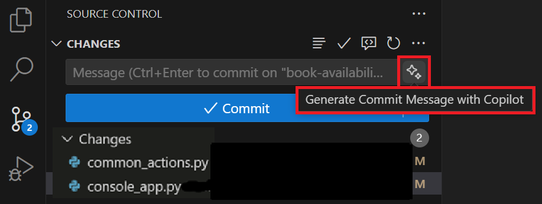

---
lab:
  title: 'Ejercicio: Desarrollo de nuevas características de código mediante GitHub Copilot (Python)'
  description: "Obtenga información sobre cómo acelerar el desarrollo de nuevas características de código mediante GitHub Copilot en Visual\_Studio Code."
---

# Desarrollo de nuevas características de código mediante GitHub Copilot

Las características de finalización de código y chat interactivo de GitHub Copilot ayudan a los desarrolladores a escribir código más rápido y con menos errores. Proporciona sugerencias para fragmentos de código, funciones e incluso clases completas basadas en el contexto del código que se está escribiendo. En este ejercicio, usará GitHub Copilot para acelerar el desarrollo de nuevas características de código en Visual Studio Code.

Este ejercicio debería tardar en completarse **30** minutos aproximadamente.

> **IMPORTANTE**: Para completar este ejercicio, debe proporcionar su propia cuenta de GitHub y suscripción de GitHub Copilot. Si no tiene una cuenta de GitHub, puede <a href="https://go.microsoft.com/fwlink/?linkid=2320148" target="_blank">registrarse</a> para obtener una cuenta individual gratuita y usar un plan gratuito de GitHub Copilot para completar el ejercicio. Si tiene acceso a una suscripción de GitHub Copilot Pro, GitHub Copilot Pro+, GitHub Copilot Business o GitHub Copilot Enterprise desde el entorno de laboratorio, puede usar la suscripción de GitHub Copilot existente para completar este ejercicio.

## Antes de comenzar

El entorno de laboratorio debe incluir lo siguiente: Git 2.48 o posterior, Python 3.10 o posterior, Visual Studio Code con la extensión Python de Microsoft y acceso a una cuenta de GitHub con GitHub Copilot habilitado.

Si usa un equipo local como entorno de laboratorio para este ejercicio:

- Para obtener ayuda a fin de configurar el equipo local como entorno de laboratorio, abra el siguiente vínculo en un explorador: <a href="https://microsoftlearning.github.io/mslearn-github-copilot-dev/Instructions/Labs/LAB_AK_00_configure_lab_environment_py.html" target="_blank">Configure los recursos de entorno de laboratorio</a>.

- Para obtener ayuda a fin de habilitar la suscripción de GitHub Copilot en Visual Studio Code, abra el siguiente vínculo en un explorador: <a href="https://go.microsoft.com/fwlink/?linkid=2320158" target="_blank">Habilitación de GitHub Copilot en Visual Studio Code</a>.

Si usa un entorno de laboratorio hospedado para este ejercicio:

- Para obtener ayuda a fin de habilitar la suscripción de GitHub Copilot en Visual Studio Code, pegue la siguiente dirección URL en la barra de navegación del sitio de un explorador: <a href="https://go.microsoft.com/fwlink/?linkid=2320158" target="_blank">Habilitación de GitHub Copilot en Visual Studio Code</a>.

- Abra un terminal de comandos y luego ejecute los siguientes comandos:

    A fin de asegurarse de que Visual Studio Code está configurado para usar la versión correcta de Python, compruebe que la instalación de Python sea la versión 3.10 o posterior:

    ```bash
    python --version
    ```

    Para asegurarse de que Git está configurado para usar el nombre y la dirección de correo electrónico, actualice los siguientes comandos con la información y, después, ejecute los comandos:

    ```bash

    git config --global user.name "John Doe"

    ```

    ```bash

    git config --global user.email johndoe@example.com

    ```

## Escenario del ejercicio

Es un desarrollador que trabaja en el departamento de TI de la comunidad local. Los sistemas de back-end que admiten la biblioteca pública se han perdido en un incendio. El equipo debe desarrollar un proyecto temporal para ayudar al personal de la biblioteca a administrar sus operaciones hasta que se pueda reemplazar el sistema. El equipo ha elegido GitHub Copilot para acelerar el proceso de desarrollo.

Los usuarios finales probaron una versión inicial de la aplicación de biblioteca y se solicitaron varias características adicionales. El equipo ha acordado trabajar con las siguientes características:

- Disponibilidad del libro: Habilite un bibliotecario para determinar el estado de disponibilidad de un libro. Esta característica debe mostrar un mensaje que indica si un libro está disponible para el préstamo o la fecha de vencimiento de devolución si el libro está actualmente en préstamo a otro patrón.

- Préstamos de libros: Permitir que un bibliotecario preste un libro a un patrón (si el libro está disponible). Esta característica debe mostrar la opción de que un cliente reciba un libro en préstamo, actualice Loans.json con el nuevo préstamo y muestre los detalles del préstamo para el patrón.

- Reservación de libros: Permitir que un bibliotecario reserve un libro para un patrón (a menos que el libro ya esté reservado). Esta característica debe implementar un nuevo proceso de reserva de libros. Esta característica puede requerir la creación de un nuevo archivo Reservations.json junto con las nuevas clases e interfaces necesarias para admitir el proceso de reserva.

Cada miembro del equipo trabajará en una de las nuevas características y, después, volverá a reunirse. Trabajará en la característica para determinar el estado de disponibilidad de un libro. Su compañero de trabajo trabajará en la característica para prestar un libro a un patrón. La última característica, para reservar un libro para un patrón, se desarrollará después de que se completen las otras dos características.

Este ejercicio incluye las siguientes tareas:

1. Configurar la aplicación de biblioteca en Visual Studio Code.

1. Usar Visual Studio Code a fin de crear un repositorio de GitHub para la aplicación de biblioteca.

1. Cree una rama de "disponibilidad de libros" en el repositorio de código.

1. Desarrollar una nueva característica de "disponibilidad de libros".

    - Use sugerencias de GitHub Copilot para ayudar a implementar el código de forma más rápida y precisa.
    - Sincronice las actualizaciones del código a la rama "disponibilidad de libros" del repositorio remoto.

1. Combinar las actualizaciones de "disponibilidad del libro" en la rama principal del repositorio.

## Configurar la aplicación de biblioteca en Visual Studio Code.

Debe descargar la aplicación existente, extraer los archivos de código y, después, abrir el proyecto en Visual Studio Code.

Siga estos pasos para configurar la aplicación de la biblioteca:

1. Abra una ventana del explorador en el entorno de laboratorio.

1. Para descargar un archivo ZIP con la aplicación de biblioteca, pegue la siguiente dirección URL en la barra de direcciones del explorador: [Laboratorio de GitHub Copilot: Desarrollo de características de código](https://github.com/MicrosoftLearning/mslearn-github-copilot-dev/raw/refs/heads/main/DownloadableCodeProjects/Downloads/AZ2007LabAppM3Python.zip)

    El archivo ZIP se denomina **AZ2007LabAppM3Python.zip**.

1. Extraiga los archivos del archivo **AZ2007LabAppM3Python.zip**.

    Por ejemplo:

    1. Vaya a la carpeta de descargas del entorno de laboratorio.

    1. Haga clic con el botón derecho en **AZ2007LabAppM3Python.zip** y luego seleccione **Extraer todo**.

    1. Seleccione **Mostrar los archivos extraídos al completar** y, a continuación, **Extraer**.

1. Abra la carpeta de archivos extraídos y, después, copie la carpeta **AccelerateDevGHCopilot** en una ubicación que sea fácil de acceder, como la carpeta Escritorio de Windows.

1. Abra la carpeta **AccelerateDevGHCopilot** en Visual Studio Code.

    Por ejemplo:

    1. Abra Visual Studio Code en el entorno de laboratorio.

    1. En Visual Studio Code, en el menú **Archivo**, seleccione **Abrir archivo**.

    1. Vaya a la carpeta Escritorio de Windows, seleccione **AccelerateDevGHCopilot** y luego **Seleccionar carpeta**.

1. En la vista EXPLORADOR de Visual Studio Code, compruebe la siguiente estructura del proyecto:

    - AccelerateDevGHCopilot/library   ├── application_core   ├── console   ├── infrastructure   └── tests   └── readme.md

1. Asegúrese de que la aplicación se ejecuta correctamente.

    Por ejemplo, abra un terminal en Visual Studio Code, vaya al **directorio AccelerateDevGHCopilot/library** y ejecute el siguiente comando:

    ```bash
    python -m unittest discover -v tests
    ```

    Verá varias Advertencias, pero no debería haber Errores.

## Creación del repositorio de GitHub para el código

La creación del repositorio de GitHub para el código le habilitará compartir su trabajo con otros usuarios y colaborar en el proyecto.

> **NOTA**: Use su propia cuenta de GitHub para crear un repositorio privado de GitHub para la aplicación de biblioteca.

Completa los siguientes pasos para usar esta sección del ejercicio:

1. Abra una ventana del explorador y navegue a la cuenta de GitHub.

    La página de inicio de sesión de GitHub es: [https://github.com/login](https://github.com/login).

1. Inicie sesión en su cuenta de GitHub.

1. Abra el menú de la cuenta de GitHub y seleccione **Los repositorios**.

1. Cambie a la ventana de Visual Studio Code.

1. En Visual Studio Code, abra la vista Control de código fuente.

1. Seleccione **Publicación en GitHub**.

1. Nombre del repositorio **AccelerateDevGHCopilot**.

    > **NOTA**: Si no ha iniciado sesión en GitHub en Visual Studio Code, se le pedirá que inicie sesión. Una vez que haya iniciado sesión, autorice Visual Studio Code con los permisos solicitados.

1. Seleccione **Publicar en el repositorio privado de GitHub**.

1. Observe que Visual Studio Code muestra los mensajes de estado durante el proceso de publicación.

    Cuando finalice el proceso de publicación, verá un mensaje que le informa de que el código se publicó correctamente en el repositorio de GitHub que especificó.

1. Cambie a la ventana del explorador de la cuenta de GitHub.

1. Abra el nuevo repositorio AccelerateDevGHCopilot en la cuenta de GitHub.

    Si no ve el repositorio AccelerateDevGHCopilot, actualice la página. Si sigue sin ver el repositorio, pruebe los pasos siguientes:

    1. Vaya a Visual Studio Code.
    1. Abra las notificaciones (se generó una notificación cuando se publicó el nuevo repositorio).
    1. Seleccione **Abrir en GitHub** para abrir el repositorio.

## Creación de una rama en el repositorio

Antes de empezar a desarrollar la nueva característica "disponibilidad de libros", debe crear una nueva rama en el repositorio. Esto le permite trabajar en la nueva característica sin afectar a la rama principal del repositorio. Puede combinar la nueva característica en la rama principal cuando el código esté listo.

Completa los siguientes pasos para usar esta sección del ejercicio:

1. Asegúrese de que tiene abierto el proyecto AccelerateDevGHCopilot en Visual Studio Code.

1. Seleccione la vista Control de código fuente y asegúrese de que el repositorio local está sincronizado con el repositorio remoto (Extracción o Sincronización).

1. En la esquina inferior izquierda de la ventana, seleccione **principal**.

1. Para crear una nueva rama, escribe **disponibilidad de libro** y después selecciona **+ Crear nueva rama**.

1. Para insertar la nueva rama en el repositorio remoto, seleccione **Publicar rama**.

## Uso de GitHub Copilot para desarrollar una nueva característica de "disponibilidad de libros"

En esta sección del ejercicio, usará GitHub Copilot a fin de desarrollar una nueva característica para la aplicación de biblioteca. La característica solicitada permitirá a un bibliotecario comprobar si un libro está disponible para el préstamo, un escenario común que no es compatible actualmente con la aplicación de biblioteca actual.

Para implementar la característica de disponibilidad de libros, deberá completar las siguientes actualizaciones:

- Agregue una nueva acción de **SEARCH_BOOKS** a la enumeración **CommonActions** en **library/console/common_actions.py**.

- Actualice el método **WriteInputOptions** en **library/console/console_app.py**.

  - Agregue compatibilidad con la nueva opción **CommonActions.SEARCH_BOOKS**.
  - Muestra la opción para comprobar si hay un libro disponible para el préstamo.

- Actualice el método **ReadInputOptions** en **library/console/console_app.py**.

  - Agregue compatibilidad con la nueva opción **CommonActions.SEARCH_BOOKS**.

- Actualice el método **PatronDetails** en **library/console/console_app.py**.

  - Agregue **CommonActions.SearchBooks** a **opciones** antes de llamar a **ReadInputOptions**.
  - Agregue un elemento **else if** para controlar la acción **SEARCH_BOOK**.
  - El bloque **else if** debe llamar a un nuevo método denominado **SEARCH_BOOKS**.

- Cree un método **SEARCH_BOOKS** en **library/console/console_app.py**.

  - El método **SEARCH_BOOKS** debe leer un título de libro proporcionado por el usuario.
  - Compruebe si un libro está disponible para préstamo y muestre un mensaje que indique:

    - "**book.title** está disponible para préstamo", o
    - "**book.title** está prestado a otro usuario. La fecha de vencimiento de la devolución es **loan.DueDate**".

GitHub Copilot Chat puede ayudarle a implementar las actualizaciones de código necesarias para completar la nueva característica.

- Puede usar sesiones de chat en línea para implementar actualizaciones de código más pequeñas y discretas en función de sus requisitos.
- Puede usar la vista Chat para trabajar en actualizaciones de código más grandes que pueden requerir un enfoque más conversacional e iterativo.

### Implementación de actualizaciones de "disponibilidad de libros" mediante chat en línea de Copilot

Las sesiones de **chat en línea de Copilot** le permiten interactuar con GitHub Copilot directamente en el editor de código. Puede usar el chat en línea para formular preguntas, solicitar sugerencias de código y obtener explicaciones para el código generado por GitHub Copilot.

Completa los siguientes pasos para usar esta sección del ejercicio:

1. Abra la vista EXPLORADOR.

1. Expanda el proyecto **library/console**.

1. Abra el archivo **console/common_actions.py** y luego **seleccione** la clase **CommonActions**.

    Debe agregar una nueva acción **SEARCH_BOOKS** a **CommonActions**.

1. Abra el chat en línea: Mantenga el puntero sobre la selección, haga clic con el botón derecho para que se abra un menú, elija **"Copilot"** y seleccione **Chat insertado del editor**.

1. Escriba lo siguiente:

    ```plaintext
    Update selection to include a new `SEARCH_BOOKS` action.
    ```

    GitHub Copilot debe sugerir una actualización de código que agregue la nueva acción **SEARCH_BOOK** a la clase **CommonActions**.

1. Revise la actualización sugerida y seleccione **Aceptar**.

    El código actualizado debe tener un aspecto similar al siguiente fragmento de código:

    ```python

    class CommonActions(Flag):
        REPEAT = 0
        SELECT = auto()
        QUIT = auto()
        SEARCH_PATRONS = auto()
        SEARCH_BOOKS = auto() # added
        RENEW_PATRON_MEMBERSHIP = auto()
        RETURN_LOANED_BOOK = auto()
        EXTEND_LOANED_BOOK = auto()
    ```

    Observe la incorporación de `SEARCH_BOOKS = auto()` a `CommonActions`.

1. Abra el archivo **library/console/console_app.py**.

1. Busque y luego seleccione el método `write_input_options` en la clase `ConsoleApp`. Mantenga el puntero sobre la selección, haga clic con el botón derecho para que se abra un menú, elija **"Copilot"** y seleccione **Chat insertado del editor**.

    Debe agregar compatibilidad con la nueva opción `CommonActions.SEARCH_BOOKS`. Si existe la opción `SEARCH_BOOKS`, muéstrela a fin de comprobar si hay un libro disponible para el préstamo.

1. Abra el chat en línea y escriba el siguiente símbolo del sistema:

    ```plaintext
    Update selection to include an option for the `CommonActions.SEARCH_BOOKS` action. Use the letter "b" and the message "to check for book availability".
    ```

    GitHub Copilot debe sugerir una actualización de código que agregue un nuevo bloque de `if` para la acción `SEARCH_BOOKS`.

1. Revise la actualización sugerida y seleccione **Aceptar**.

    La actualización sugerida debe ser similar al siguiente fragmento de código:

    ```python
        def write_input_options(self, options):
        print("Input Options:")
        if options & CommonActions.RETURN_LOANED_BOOK:
            print(' - "r" to mark as returned')
        if options & CommonActions.EXTEND_LOANED_BOOK:
            print(' - "e" to extend the book loan')
        if options & CommonActions.RENEW_PATRON_MEMBERSHIP:
            print(' - "m" to extend patron\'s membership')
        if options & CommonActions.SEARCH_PATRONS:
            print(' - "s" for new search')
        if options & CommonActions.SEARCH_BOOKS:
            print(' - "b" to check for book availability')
        if options & CommonActions.QUIT:
            print(' - "q" to quit')
        if options & CommonActions.SELECT:
            print(' - type a number to select a list item.')
    ```

1. Desplácese hacia abajo para buscar y, después, seleccione el método `_handle_patron_details_selection` (o la sección de control de entrada) en el archivo **library/console/console_app.py**.

    Debe agregar compatibilidad con la nueva opción `CommonActions.SEARCH_BOOKS` otra vez más. Incluya un caso que controle al usuario que selecciona la acción `SEARCH_BOOKS` (por ejemplo, cuando el usuario escribe "b").

1. Abra el chat en línea y escriba el siguiente símbolo del sistema:

    ```plaintext
    Update selection to include an option for the `CommonActions.SEARCH_BOOKS` action.
    ```

    GitHub Copilot debe sugerir una actualización que agregue un nuevo bloque `elif` que controle al usuario la selección de la acción `SEARCH_BOOKS`.

1. Revise la actualización sugerida y seleccione **Aceptar**.

    La actualización sugerida debe ser similar al siguiente fragmento de código:

    ```python
    def _handle_patron_details_selection(self, selection, patron, valid_loans):
    # ...existing code...

        elif selection == 'b':
            # Placeholder for book search functionality
            print("Book search functionality is not implemented yet.")
            return ConsoleState.PATRON_DETAILS
        elif selection.isdigit():
            idx = int(selection)
            if 1 <= idx <= len(valid_loans):
                self.selected_loan_details = valid_loans[idx - 1][1]
                return ConsoleState.LOAN_DETAILS
            print("Invalid selection. Please enter a number shown in the list above.")
            return ConsoleState.PATRON_DETAILS
        else:
            print("Invalid input. Please enter a number, 'm', 's', 'b', or 'q'.")
            return ConsoleState.PATRON_DETAILS
    ```

#### Uso del Chat insertado de Copilot para compartir una selección de código en GitHub Copilot Chat

1. Asegúrese de que GitHub Copilot Chat está abierto en el **modo Preguntar**.

1. Hay dos cosas que debe realizar:

    - Debe agregar `CommonActions.SEARCH_BOOKS` a `options` antes de llamar a `_get_patron_details_input`.
    - También debe agregar un bloque `if` o `elif` para controlar la selección `"b"` de la acción `SEARCH_BOOKS`. El bloque debe llamar a un nuevo método denominado `search_books`.

    Puede abordar ambos requisitos con la misma indicación.

1. Busque y luego **seleccione** el método `patron_details` en el archivo **library/console/console_app.py**.

1. Con el método `patron_details` aún seleccionado, mantenga el puntero sobre la selección. **Haga clic con el botón derecho** y se abrirá un menú, elija **"Copilot"** y seleccione **"Agregar selección a chat"**.

1. Escriba lo siguiente:

    ```plaintext
    @workspace Update selection to add `CommonActions.SEARCH_BOOKS` to `options` before calling `_get_patron_details_input`. Add an `if` or `elif` block to handle the `"b"` selection for the `SEARCH_BOOKS` action. The block should call a new method named `search_books`.
    ```

    GitHub Copilot Chat debe sugerir una actualización de código que agregue `CommonActions.SEARCH_BOOKS` a `options` antes de llamar a `_get_patron_details_input`. Para el código proporcionado, seleccione el icono "Aplicar en el editor".

    

1. Revise la actualización sugerida y seleccione **Aceptar**.
    ```python
    def patron_details(self) -> ConsoleState:
        patron = self.selected_patron_details
        print(f"\nName: {patron.name}")
        print(f"Membership Expiration: {patron.membership_end}")
        loans = self._loan_repository.get_loans_by_patron_id(patron.id)
        print("\nBook Loans History:")

        valid_loans = self._print_loans(loans)

        if valid_loans:
            options = (
                CommonActions.RENEW_PATRON_MEMBERSHIP
                | CommonActions.SEARCH_PATRONS
                | CommonActions.QUIT
                | CommonActions.SELECT
                | CommonActions.SEARCH_BOOKS  # Added SEARCH_BOOKS to options
            )
            selection = self._get_patron_details_input(options)
            return self._handle_patron_details_selection(selection, patron, valid_loans)
        else:
            print("No valid loans for this patron.")
            options = (
                CommonActions.SEARCH_PATRONS
                | CommonActions.QUIT
                | CommonActions.SEARCH_BOOKS  # Added SEARCH_BOOKS to options
            )
            selection = self._get_patron_details_input(options)
            return self._handle_no_loans_selection(selection)

    def _handle_patron_details_selection(self, selection, patron, valid_loans):
        if selection == 'q':
            return ConsoleState.QUIT
        elif selection == 's':
            return ConsoleState.PATRON_SEARCH
        elif selection == 'm':
            status = self._patron_service.renew_membership(patron.id)
            print(status)
            self.selected_patron_details = self._patron_repository.get_patron(patron.id)
            return ConsoleState.PATRON_DETAILS
        elif selection == 'b':
            return self.search_books()  # Call the new search_books method
        elif selection.isdigit():
            idx = int(selection)
            if 1 <= idx <= len(valid_loans):
                self.selected_loan_details = valid_loans[idx - 1][1]
                return ConsoleState.LOAN_DETAILS
            print("Invalid selection. Please enter a number shown in the list above.")
            return ConsoleState.PATRON_DETAILS
        else:
            print("Invalid input. Please enter a number, 'm', 's', 'b', or 'q'.")
            return ConsoleState.PATRON_DETAILS

    def _handle_no_loans_selection(self, selection):
        if selection == 'q':
            return ConsoleState.QUIT
        elif selection == 's':
            return ConsoleState.PATRON_SEARCH
        elif selection == 'b':
            return self.search_books()  # Handle SEARCH_BOOKS when no loans
        else:
            print("Invalid input.")
            return ConsoleState.PATRON_DETAILS

    def search_books(self) -> ConsoleState:
        print("Book search functionality is not implemented yet.")
        return ConsoleState.PATRON_DETAILS

    ```
<!-- TODO: Delete or restore? Previous version that resulted in the Agent bug fix
     ```python

    def patron_details(self) -> ConsoleState:
    patron = self.selected_patron_details
    print(f"\nName: {patron.name}")
    print(f"Membership Expiration: {patron.membership_end}")
    loans = self._loan_repository.get_loans_by_patron_id(patron.id)
    print("\nBook Loans History:")

    valid_loans = self._print_loans(loans)

    if valid_loans:
        options = (
            CommonActions.RENEW_PATRON_MEMBERSHIP
            | CommonActions.SEARCH_PATRONS
            | CommonActions.QUIT
            | CommonActions.SELECT
            | CommonActions.SEARCH_BOOKS
        )
        selection = self._get_patron_details_input(options)
        if selection == 'b':
            return self.search_books()
        return self._handle_patron_details_selection(selection, patron, valid_loans)
    else:
        print("No valid loans for this patron.")
        options = (
            CommonActions.SEARCH_PATRONS
            | CommonActions.QUIT
            | CommonActions.SEARCH_BOOKS
        )
        selection = self._get_patron_details_input(options)
        if selection == 'b':
            return self.search_books()
        return self._handle_no_loans_selection(selection)

    def search_books(self) -> ConsoleState:
        print("Book search option selected.")
        return ConsoleState.PATRON_DETAILS
    ``` 

-->

    > **NOTE**: The code suggested by Inline chat may include stub code for the **search_books()** method as in the previous code sample. You can accept that code stub, but you'll implement the **search_books** method in the next section.

### Implementación de un método de SEARCH_BOOKS mediante el modo Preguntar de Copilot Chat

Queda un paso para implementar las actualizaciones de "disponibilidad de libros", crear el método **search_books**. El método **search_books** leerá un título de libro proporcionado por el usuario, comprobará si un libro está disponible para préstamo y mostrará un mensaje que indica el estado de disponibilidad del libro. Usará la vista Chat para evaluar los requisitos e implementar el método **search_books**.

La vista Chat de GitHub Copilot proporciona un entorno conversacional e interactivo que no está disponible al usar chat en línea. Puede usar la vista Chat para formular preguntas, solicitar sugerencias de código y obtener explicaciones para el código generado por GitHub Copilot. La vista Chat admite los tres modos siguientes:

- Modo de pregunta: El modo Preguntar se usa para comprender mejor su código base, ideas de lluvia de ideas y ayuda con las tareas de codificación. Las sugerencias de código generadas en el modo Preguntar se pueden implementar directamente en el código base o copiarlas en el Portapapeles.
- Modo de edición: El modo de edición se usa para realizar cambios en el código, como refactorizar o agregar nuevas características. El modo de edición puede realizar modificaciones en varios archivos del proyecto.
- Modo de agente: El modo de agente se usa para definir una tarea de alto nivel e iniciar una sesión de edición de código agente para realizar esa tarea. En el modo de agente, Copilot planea de forma autónoma el trabajo necesario y determina los archivos y el contexto pertinentes. El agente puede realizar cambios en el código, ejecutar pruebas e incluso implementar la aplicación.
<!-- TODO: line below do we use all 3 listed modes? -->
Usará los modos **Chat insertado**, **Preguntar** y **Editar** para implementar el método **search_books**.

Completa los siguientes pasos para usar esta sección del ejercicio:

1. Dedique un minuto a reflexionar sobre los requisitos de proceso del método **search_books**.

    ¿Cuál es el proceso que necesita completar el método? ¿Cuál es el tipo de valor devuelto para este método? ¿Requiere parámetros?

    El método **search_books** debe implementar el siguiente proceso:

    1. Pida al usuario un título de libro.
    1. Lea el título del libro proporcionado por el usuario.
    1. Compruebe si hay un libro disponible para el préstamo.
    1. Muestra un mensaje que indica una de las siguientes opciones:

        - "**{book.title}** está disponible para préstamo"
        - "**{book.title}** está prestado a otro usuario. La fecha de vencimiento de la devolución es **{loan.due_date}**".

    Para compilar las opciones de mensaje, el código tendrá que acceder a los siguientes archivos JSON:

    - **Books.json** es necesario para encontrar el **Título** y el **Id** coincidentes.
    - **BookItems.json** es necesario para encontrar el **BookId** para cada copia física de un libro (donde **BookId** coincide con el **Id** en **Books.json**).
    - **Loans.json** es necesario para buscar **ReturnDate** y **DueDate** para el **BookItemId** coincidente (donde **BookItemId** coincide con el **Id** en **BookItems.json**).

> **Nota:**  
> El campo **BookItemId** de **Loans.json** hace referencia al **Id** en **BookItems.json**.  
> El campo **BookId** de **BookItems.json** hace referencia al **Id** en **Books.json**.

1. Asegúrese de que tiene el siguiente método **search_books** creado en el archivo **console_app.py**:

    ```python

    def search_books(self) -> ConsoleState:
        print("Book search functionality is not implemented yet.")
        return ConsoleState.PATRON_DETAILS

    ```

    > **NOTA**: Asegúrese de quitar los comentarios de código creados por GitHub Copilot. Los comentarios innecesarios e inexactos pueden influir negativamente en las sugerencias de GitHub Copilot.

1. Abra el archivo **console_app.py** en VSCode y seleccione el método **search_books**.

1. Abra la vista Chat y escriba el siguiente símbolo del sistema:

    ```plaintext
    @workspace Update selection to obtain a book title. Prompt the user to "Enter a book title to search for". Read the user input and ensure the book title isn't null.
    ```

1. Revise la actualización sugerida.

    La actualización sugerida debe ser similar al siguiente fragmento de código:

    ```python

    def search_books(self) -> ConsoleState:
        while True:
            book_title = input("Enter a book title to search for: ").strip()
            if not book_title:
                print("No input provided. Please enter a book title.")
            else:
                # Placeholder for future book search logic
                print(f"Searching for book titled: {book_title}")
                break
        return ConsoleState.PATRON_DETAILS

    ```

1. Mantenga el puntero del ratón sobre el código sugerido y, después, seleccione **Aplicar a library\console\console_app.py**.

    El código sugerido debe estar visible en el editor de código, con opciones para **Mantener** o **Deshacer**.

1. En el editor de código, para aceptar el código sugerido, seleccione **Mantener**.

1. Seleccione el método **search_books**.

1. Use las operaciones de arrastrar y colocar para agregar los siguientes archivos al contexto de chat:

    - library/console/**console_app.py** (archivo actual seleccionado)
    - library/console/**main.py**
    - library/infrastructure/Json/**Books.json**
    - library/infrastructure/Json/**Loans.json**
    - library/infrastructure/Json/**BookItems.json**
    - library/infrastructure/**json_data.py**
    - library/infrastructure/**json_loan_repository.py**

1. Escriba lo siguiente:

    ```plaintext
    @workspace provide a simple text overview plan of how to update the search_books method and ConsoleApps class to find a matching book title in the Books.json file. Use the user supplied book title to find a matching book. If a book is found, use Loans.json to check if the book is available for loan. If the book has been returned, display a message stating "book.title is available for loan". If the book is on loan, display a message stating "book.title is on loan to another patron. The return due date is loan.DueDate". Don't provide code yet. List the general change recommendations for each high level item as a numbered list of paragraphs.
    ```

1. Dedique un minuto a revisar las actualizaciones sugeridas.

    La respuesta debe incluir la siguiente información:

    ```plaintext

    1. Update the ConsoleApp class to access book data:  
    Add a reference to the book repository or the loaded books data from JsonData within the ConsoleApp class. This will allow the search_books method to access the list of all books and perform searches based on user input.
    
    2. Modify the search_books method to search for a book:  
    Update the search_books method to use the user-supplied book title to search for a matching book in the loaded books data (from Books.json). The search should be case-insensitive and match the title exactly or partially, depending on requirements.
    
    3. Check book availability using loan data:  
    Once a matching book is found, use the book's ID to find all related book items (copies) and then check the Loans.json data to determine if any copies are currently on loan (i.e., have a loan record with a null ReturnDate). If all copies are returned, the book is available for loan.
    
    4. Display book availability status to the user:  
    If at least one copy of the book is available (not currently on loan), display a message such as "book.title is available for loan." If all copies are on loan, display a message such as "book.title is on loan to another patron. The return due date is loan.DueDate," using the due date from the active loan.
    
    5. Handle no match or multiple matches:  
    If no book matches the search, display an appropriate message to the user. Optionally, if multiple books match, prompt the user to refine their search or select from a list.
    
    6. Keep user in the book search loop:  
    After displaying the result, allow the user to search for another book or return to the previous menu, maintaining a smooth user experience.

    ```

    > **NOTA**: Es posible que haya recibido actualizaciones de código en la respuesta de GitHub Copilot. 
    > Las actualizaciones de código se abordarán en el paso siguiente.

    También puede usar el modo **Preguntar** de la vista chat para analizar las actualizaciones de código y luego usar el modo **Edición** para implementar las actualizaciones de código.

1. Revise las indicaciones de ejemplo (se le pedirá más adelante).

    ```plaintext

    Update the search_books method and ConsoleApp class so that when a user enters a book title, the app searches 
    Books.json for a matching title (case-insensitive, partial match allowed). If a match is found, check all 
    related BookItem records and their loan status in Loans.json. If any copy is not currently on loan (no active 
    loan or has a ReturnDate), display "book.title is available for loan". If all copies are on loan, display 
    "book.title is on loan to another patron. The return due date is loan.DueDate" (show the soonest due date). 
    Integrate this logic into the user flow and ensure clear user messaging.
    ```

    Puede ajustar el mensaje para lograr requisitos específicos solicitando a Copilot que le genere una indicación a partir de los comentarios de Copilot. A continuación se muestra una indicación de ejemplo generada por Copilot para su revisión:

    ```plaintext

    Update the ConsoleApp class and its search_books method to implement the following:
    
    1. Add access to the loaded books data (from JsonData or a book repository) in ConsoleApp.
    2. In search_books, use the user-supplied book title to search for a matching book in Books.json (case-insensitive, partial or exact match).
    3. If a book is found, use its ID to find all related book items (copies) and check Loans.json to see if any copies are currently on loan (ReturnDate is null).
    4. If at least one copy is available, display: "book.title is available for loan." If all are on loan, display: "book.title is on loan to another patron. The return due date is loan.DueDate."
    5. If no book matches, inform the user. If multiple books match, prompt for refinement or selection.
    6. After displaying the result, allow the user to search again or return to the previous menu.
        
    Please provide the complete implementation for this book search and availability feature.
    ```

### Implementación del método search_books mediante el modo Edición de Copilot Chat

1. Para cambiar la vista Chat al modo de edición, seleccione **Establecer modo** y luego **Editar**.

    Cuando se le pida que inicie una nueva sesión, seleccione **Sí**.

1. Use las operaciones de arrastrar y colocar para agregar los siguientes archivos al contexto de chat mediante el **modo Edición de chat**:

    - library/console/**console_app.py**
    - library/console/**main.py**
    - library/infrastructure/**json_data.py**
    - library/infrastructure/Json/**Books.json**
    - library/infrastructure/Json/**Loans.json**
    - library/infrastructure/Json/**BookItems.json**

1. Seleccione el método **search_books** en **console_app.py**.

1. Escriba lo siguiente:

    ```plaintext

    @workspace Update the ConsoleApp class so it can access the loaded books data from JsonData or a book repository, and update main.py to instantiate ConsoleApp with the loaded JsonData instance by passing json_data=json_data. In the search_books method, prompt the user for a book title and search for a matching book in Books.json using a case-insensitive, partial or exact match. If a book is found, use its ID to find all related book items (copies) and check Loans.json to determine if any copies are currently on loan (ReturnDate is null). If at least one copy is available, display a message stating the book is available for loan; if all are on loan, display a message with the book title and the due date of the loan. If no book matches, inform the user, and if multiple books match, prompt for refinement or selection. After displaying the result, allow the user to search again or return to the previous menu.
    ```

1. Dedique un minuto a revisar las actualizaciones sugeridas en el archivo console_app.py.

    Puede usar **Anterior** y **Siguiente** para navegar por las actualizaciones de código sugeridas, o bien puede desplazarse manualmente por el archivo.

    **console_app.py**

    Las actualizaciones de código que agregan la dependencia **json_data** al constructor **console_app** se pueden encontrar cerca de la parte superior de la clase ConsoleApp.

    ```python
    class ConsoleApp:
        def **init**(
            self,
            loan_service: ILoanService,
            patron_service: IPatronService,
            patron_repository: IPatronRepository,
            loan_repository: ILoanRepository,
            json_data=None,  # <-- Add json_data for direct access to books/items
            book_repository=None  # <-- Optionally allow a book repo
        ):
            self._current_state: ConsoleState = ConsoleState.PATRON_SEARCH
            self.matching_patrons = []
            self.selected_patron_details = None
            self.selected_loan_details = None
            self._patron_repository = patron_repository
            self._loan_repository = loan_repository
            self._loan_service = loan_service
            self._patron_service = patron_service
            self._json_data = json_data   # <-- store json_data
            self._book_repository = book_repository
    ```

    El código completa el método `search_books` para implementar la funcionalidad en el código auxiliar a fin de comprobar si usar **json_data** para encontrar un libro por título, recuperar su BookItem, comprobar si hay un préstamo activo y mostrar la disponibilidad o el estado del préstamo según se solicite.

    ```python
        def search_books(self) -> ConsoleState:
        while True:
            book_title = input("Enter a book title to search for: ").strip()
            if not book_title:
                print("No book title provided. Please try again.")
                continue

            # Case-insensitive, partial or exact match
            books = self._json_data.books
            matches = [b for b in books if book_title.lower() in b.title.lower()]

            if not matches:
                print("No matching books found.")
                again = input("Search again? (y/n): ").strip().lower()
                if again == 'y':
                    continue
                else:
                    return ConsoleState.PATRON_DETAILS

            if len(matches) == 1:
                book = matches[0]
            else:
                print("\nMultiple books found:")
                for idx, b in enumerate(matches, 1):
                    print(f"{idx}) {b.title}")
                selection = input("Select a book by number or 'r' to refine search: ").strip().lower()
                if selection == 'r':
                    continue
                if not selection.isdigit() or not (1 <= int(selection) <= len(matches)):
                    print("Invalid selection.")
                    continue
                book = matches[int(selection) - 1]

            # Find all book items (copies) for this book
            book_items = [bi for bi in self._json_data.book_items if bi.book_id == book.id]
            if not book_items:
                print("No copies of this book are in the library.")
                again = input("Search again? (y/n): ").strip().lower()
                if again == 'y':
                    continue
                else:
                    return ConsoleState.PATRON_DETAILS

            # Find all loans for these book items
            loans = self._json_data.loans
            on_loan = []
            available = []
            for item in book_items:
                # Find latest loan for this item (if any)
                item_loans = [l for l in loans if l.book_item_id == item.id]
                if item_loans:
                    # Get the most recent loan (by LoanDate)
                    latest_loan = max(item_loans, key=lambda l: l.loan_date or l.due_date or l.return_date or 0)
                    if latest_loan.return_date is None:
                        on_loan.append(latest_loan)
                    else:
                        available.append(item)
                else:
                    available.append(item)

            if available:
                print(f"Book '{book.title}' is available for loan.")
            else:
                # All copies are on loan, show due dates
                due_dates = [l.due_date for l in on_loan if l.due_date]
                if due_dates:
                    next_due = min(due_dates)
                    print(f"All copies of '{book.title}' are currently on loan. Next due date: {next_due}")
                else:
                    print(f"All copies of '{book.title}' are currently on loan.")

            again = input("Search for another book? (y/n): ").strip().lower()
            if again == 'y':
                continue
            else:
                return ConsoleState.PATRON_DETAILS 
    ```

    **main.py**

    Se modificó la creación de instancias de `ConsoleApp` para pasar `json_data` a fin de que la aplicación pueda acceder a los archivos de datos JSON.

    ```python
    # ...existing code...
            app = ConsoleApp(
            loan_service=loan_service,
            patron_service=patron_service,
            patron_repository=patron_repo,
            loan_repository=loan_repo,
            json_data=json_data  # <-- Pass json_data so ConsoleApp can access books/items/loans
        )
    # ...existing code...
    
    ```

1. En la vista Chat, para mantener todas las modificaciones, seleccione **Mantener**.

    Revise siempre las sugerencias de GitHub Copilot antes de aceptar actualizaciones.

    Si no está seguro de las actualizaciones sugeridas, puede aceptar los cambios y, a continuación, pedir a GitHub Copilot una explicación. Puede revertir las modificaciones si decide que no quiere las actualizaciones.

    > **NOTA**: Si GitHub Copilot sugiere dar formato a la fecha de devolución mediante una configuración regional o un formato específicos, asegúrese de usar el método datetime.strftime() de Python para dar formato a la fecha según sea necesario.

1. Asegúrese de que ha aceptado actualizaciones en los archivos console_app.py y main.py.

1. Abra la vista EXPLORADOR de Visual Studio Code.

1. Ejecute las pruebas o inicie la aplicación para asegurarse de que las actualizaciones del código no introdujeron ningún error.

    Es posible que vea mensajes de advertencia, pero no debería haber ningún error.

    Para ejecutar las pruebas, abra un terminal en Visual Studio Code, vaya al directorio AccelerateDevGHCopilot/library y ejecute lo siguiente:

    ```bash
    python -m unittest discover tests
    ```

## Combinación de las actualizaciones de "disponibilidad del libro" en la rama principal del repositorio

Es importante probar el código antes de combinarlo en la rama principal del repositorio. Las pruebas garantizan que el código funciona según lo previsto y no presenta ningún problema nuevo. En este ejercicio, usará pruebas manuales para comprobar que la característica "disponibilidad de libros" funciona según lo previsto.

En esta sección del ejercicio, completará las siguientes tareas:

1. Pruebe la característica "disponibilidad del libro".
1. Sincronice los cambios con el repositorio remoto.
1. Cree una solicitud de incorporación de cambios para combinar los cambios en la rama principal del repositorio.

### Prueba de la característica "disponibilidad del libro"

Las pruebas manuales se pueden usar para comprobar que la nueva característica funciona según lo previsto. El uso de un origen de datos que se puede comprobar es importante. En este caso, se usan los archivos **Books.json** y **Loans.json** para comprobar que la nueva característica informa correctamente del estado de disponibilidad de un libro.

Completa los siguientes pasos para usar esta sección del ejercicio:

1. Para ejecutar la aplicación, abra un terminal en Visual Studio Code, vaya al directorio `AccelerateDevGHCopilot/library` y ejecute lo siguiente:

```bash
python console/main.py
```

1. Cuando se le solicite un nombre de patrón, escriba **Uno** y presione Entrar.

    Debería ver una lista de clientes que coinciden con la consulta de búsqueda.

1. En la indicación "Opciones de entrada", escriba **2** (selección "Usuario uno") y presione Entrar.

    - Al escribir **2**, se selecciona el segundo patrón de la lista.
    - Debería ver el nombre del patrón y el estado de suscripción seguido de los detalles del préstamo del libro.

1. Para elegir "Reservar uno", que muestra "Devuelto: False" escriba: **1**.

   - Observe que el estado es **Devuelto: False**
   - O busque un patrón con un libro que tenga el estado **"Devuelto: False"**. Anote el nombre del libro.

1. Para devolver el libro, elija: **r**

    - Observe que el estado se actualiza a **Devuelto: verdadero**

1. Vuelva a consultar los libros de "Usuario uno":

    - Para buscar un usuario, elija: **s**
    - Repita los pasos **Buscar un usuario:** para **Usuario uno**.
    - Para elegir "Reservar uno", que muestra "Devuelto: True" escriba: **1**

    Observe que se muestra el título Libros, pero no hay información de disponibilidad.

1. Compruebe la disponibilidad de la reserva y consulte un libro disponible.

    - Para comprobar la disponibilidad de la reserva: **b**
    - Busque un libro disponible, escriba: **Uno**

    Tenga en cuenta que se muestra el título de Libros y la disponibilidad se muestra como "El Libro uno está disponible para el préstamo". Observe también que no hay ninguna opción para desproteger "Reservar uno".

1. Se le pregunta ¿"Quiere buscar otro libro? (s/n): escriba: **n**.

1. Detenga la aplicación escribiendo "q" para salir.

**Hay un problema con la aplicación**. Se notifica la disponibilidad de los libros, pero no hay ninguna opción para desproteger un libro.

### Corrección del error de desprotección del libro con el modo Agente

Copilot es una herramienta de inteligencia artificial y, al igual que las personas, pueden cometer errores, por lo que debe comprobar los resultados. Para corregir este error, usará el modo agente.

1. Abra GitHub Copilot Chat y seleccione "**Modo Agente**".
1. Para agregar las pruebas manuales desde el terminal al chat:

    - En la ventana de chat, seleccione **Agregar contexto** en el chat de Copilot (asegúrese de que está en el modo Agente).
    - Escriba "Herramientas" y luego vuelva a escribir "Herramientas" y seleccione con el mouse o con la tecla "Entrar".
    - Escriba "terminalSelection" y seleccione "**terminalLastCommand** el último comando de ejecución del terminal".

1. Agregue archivos al contenido de chat abriendo los archivos enumerados en el editor en VSCode. Después, en la ventana de chat de Copilot, seleccione **Agregar contexto** y luego **Abrir editores**:

    - **console_app.py** (contiene la lógica de aplicación principal y la interacción del usuario)
    - **loan_service.py** (lógica para préstamos)
    - **json_data.py** (controla la carga/guardado de libros, artículos de libros, usuarios, autores, préstamos)
    - **json_loan_repository.py** (controla la recuperación, incorporación y actualización de registros de préstamos)
    - **Books.json** (datos de libros de ejemplo)
    - **BookItems.json** (datos de copia o elemento de libro de ejemplo)
    - **Patrons.json** (datos de usuario de ejemplo)
    - **Loans.json** (datos de préstamo/desprotección de ejemplo)
    - **Authors.json** (datos de autor de ejemplo)

1. Revise y escriba la indicación para solucionar el error (asegúrese de que Copilot Chat muestra "**Agente**"):

    ```plaintext
    @workspace My goal is to make it possible for a patron to check out an available book directly from the console app menu. Right now, when I search for a book and it is available, the app only tells me "...is available for loan" but doesn’t let me check it out. Please help me update the code so that when a book is available, the app prompts me to check it out, and if I choose yes, it creates a new loan for the current patron and book. Make sure the checkout works smoothly in the menu flow. For the loan_service add checkout functionality and ensure the console app calls this method. Only use the existing enum and menu option names as defined in the codebase. Only use enum values and menu option names that are already defined in the codebase. Do not invent, rename, or add new enum values or menu options.
    ```

    Debe observar que el Agente lee líneas específicas de varios archivos. Realiza actualizaciones y luego las comprueba e intsala más actualizaciones.

1. Revise las actualizaciones del modo de agente en **console-app.py** hacia la parte inferior del método `search_books`, que debe ser similar al código siguiente:

    ```python
    def search_books(self) -> ConsoleState:
    # ...existing code...

           if available:
                print(f"Book '{book.title}' is available for loan.")
                # Prompt to check out
                checkout = input("Would you like to check out this book? (y/n): ").strip().lower()
                if checkout == 'y':
                    if not self.selected_patron_details:
                        print("No patron selected. Please select a patron first.")
                        return ConsoleState.PATRON_SEARCH
                    # Use the first available copy
                    book_item = available[0]
                    # Create a new loan using the loan service
                    status = self._loan_service.create_loan(
                        patron_id=self.selected_patron_details.id,
                        book_item_id=book_item.id
                    )
                    print(status)
                    # Reload loans to reflect the new loan
                    if hasattr(self._json_data, 'load_data'):
                        self._json_data.load_data()
                    print(f"Book '{book.title}' checked out to {self.selected_patron_details.name}.")
                    return ConsoleState.PATRON_DETAILS
        # ...existing code...
    ```

1. Revise las actualizaciones de **loan_service.create_loan**.

```python
    def create_loan(self, patron_id: int, book_item_id: int):
        """Create a new loan for the given patron and book item, and add it to the repository."""
        from ..entities.loan import Loan
        from datetime import datetime, timedelta
        # Check if the book item is already on loan
        all_loans = getattr(self._loan_repository, 'get_all_loans', lambda: [])()
        for loan in all_loans:
            if loan.book_item_id == book_item_id and loan.return_date is None:
                return "This copy is already on loan."
        # Generate a new loan ID
        max_id = max((l.id for l in all_loans if hasattr(l, 'id')), default=0)
        new_id = max_id + 1
        now = datetime.now()
        due = now + timedelta(days=14)
        new_loan = Loan(
            id=new_id,
            book_item_id=book_item_id,
            patron_id=patron_id,
            loan_date=now,
            due_date=due,
            return_date=None
        )
        self._loan_repository.add_loan(new_loan)
        return f"Loan created. Due date: {due.date()}"

```

1. Observe las actualizaciones de ConsoleApp.search_books y LoanService.:

    Los métodos search_books y loan_service ahora se actualizan para que, cuando haya un libro disponible, la aplicación le pida al usuario que lo consulte. Si el usuario elige sí, se crea un nuevo préstamo para el usuario actual y el elemento de libro seleccionado, y el flujo de menú vuelve a los detalles del usuario. El proceso de desprotección ahora se integra sin problemas en el flujo de menús.

1. Acepte los cambios.

1. Vuelva a probar los pasos de prueba anteriores y **complete la desprotección de un libro** para asegurarse de que la corrección es correcta. Si sigue habiendo problemas, continúe con la solución de problemas con el Agente o el modo Preguntar, según sea necesario.

### Sincronización de los cambios con el repositorio remoto

1. Seleccione la vista Control de código fuente.

1. Asegúrese de que los archivos que ha actualizado se enumeran en **Cambios**.

    Debería ver los archivos common_actions.py y console_app.py que aparecen en **Cambios**. También se puede mostrar el archivo main.py.

1. Use GitHub Copilot para generar un mensaje para el **Confirmar**.

    

1. Para almacenar provisionalmente y confirmar los cambios, seleccione **Confirmar** y, a continuación, seleccione **Sí**.

1. Para sincronizar los cambios en el repositorio remoto, seleccione **Sincronizar cambios**.

### Creación de una solicitud de incorporación de cambios para combinar los cambios en la rama principal

Ha implementado la característica que permite a un bibliotecario determinar el estado de disponibilidad de un libro. Ahora debe combinar los cambios en la rama principal del repositorio. Puede crear una solicitud de incorporación de cambios para combinar los cambios en la rama principal.

Completa los siguientes pasos para usar esta sección del ejercicio:

1. Abra el repositorio de GitHub en un explorador web.

    Para abrir el repositorio de GitHub desde Visual Studio Code:

    1. En la esquina inferior izquierda de la ventana de Visual Studio Code, seleccione **book-availability**.
    1. En el menú contextual, a la derecha de la rama **book-availability**, seleccione el icono **Abrir en GitHub**.

1. En la página del repositorio de GitHub, seleccione la pestaña **Comparar y solicitud de cambios**.

1. Asegúrese de que **Base** especifica **main**, **compare** especifica **book-availability** y **Able to merge** está marcado.

1. En **Agregar una descripción**, seleccione el botón Acciones de Copilot (el icono de GitHub Copilot) y, a continuación, seleccione la opción para generar un resumen.

    > **NOTA**: El plan Gratuito de GitHub Copilot no admite la característica de resumen de solicitudes de incorporación de cambios en este momento.

    Si usa el plan Gratis de GitHub Copilot, puede escribir su propio resumen o usar el resumen siguiente para completar la solicitud de incorporación de cambios.

    ```plaintext

    This pull request introduces a new feature to the library console application: the ability to search for books and check their availability. It also includes updates to dependency injection and the CommonActions enumeration to support this functionality. Below are the most important changes grouped by theme.

    New Feature: Book Search

    Added a new SEARCH_BOOKS action to the CommonActions enumeration (library\console\common_actions.py).

    Updated PatronDetails method to handle the SEARCH_BOOKS action, including a new SEARCH_BOOKS method that allows users to search for a book by title and check its availability (library\console\console_app.py).

    Modified ReadInputOptions and WriteInputOptions methods to include the new SEARCH_BOOKS option (library/console/console_app.py).

    Dependency Injection Updates

    Added JsonData as a dependency in the ConsoleApp constructor and ensured it is registered in the DI container before ConsoleApp (library/console/console_app.py, library/console/main.py).

    ```

1. Una vez generado el resumen, seleccione **Vista previa**.

1. Dedique un minuto a revisar el resumen.

    El resumen de la solicitud de incorporación de cambios generado por GitHub Copilot debe ser similar al ejemplo siguiente:

    

1. Seleccione **Crear solicitud de incorporación de cambios**.

1. Si se pasan todas las comprobaciones y no hay conflictos con la rama base, seleccione **Combinar solicitud de incorporación de cambios** y, a continuación, seleccione **Confirmar combinación**.

    Ten en cuenta que puedes eliminar la rama **book-availability** después de combinar los cambios. Para eliminar la rama, seleccione **Eliminar rama**.

1. Vuelva a la ventana de Visual Studio Code.

1. Cambie a la rama **principal** del repositorio.

1. Abra la vista Control de código fuente y, a continuación, **extraiga** los cambios del repositorio remoto.

1. Compruebe que la característica de disponibilidad de la reserva está disponible en la rama **principal**.

## Resumen

En este ejercicio, ha descubierto cómo usar GitHub Copilot a fin de desarrollar una nueva característica de código para una aplicación de Python. Ha desarrollado la característica en una nueva rama mediante la vista Chat y chat en línea de GitHub Copilot, ha probado el código y, después, ha combinado los cambios en la rama principal del repositorio. También ha usado GitHub Copilot para generar un mensaje de confirmación y un resumen de la solicitud de incorporación de cambios.

## Limpieza

Ahora que ha terminado el ejercicio, dedique un minuto a asegurarse de que no ha realizado cambios en la cuenta de GitHub ni en la suscripción de GitHub Copilot que no quiere conservar. Si ha realizado algún cambio, reviértalos ahora.
