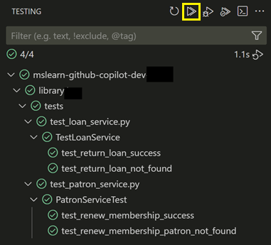

---
lab:
  title: 'Ejercicio: Desarrollo de pruebas unitarias mediante herramientas de GitHub Copilot (Python)'
  description: "Obtenga información sobre cómo acelerar el desarrollo de pruebas unitarias mediante GitHub en Visual\_Studio Code."
---

# Desarrollo de pruebas unitarias mediante GitHub Copilot

Los modelos de lenguaje grande detrás de GitHub Copilot se entrenan en una variedad de marcos de pruebas de código y escenarios. GitHub Copilot es una excelente herramienta para generar casos de prueba, métodos de prueba, aserciones de prueba y simulaciones, así como datos de prueba. En este ejercicio, usará GitHub Copilot para acelerar el desarrollo de pruebas unitarias para una aplicación de Python.

Este ejercicio debe tardar aproximadamente **25** minutos en completarse.

> **IMPORTANTE**: Para completar este ejercicio, debe proporcionar su propia cuenta de GitHub y suscripción de GitHub Copilot. Si no tiene una cuenta de GitHub, puede <a href="https://go.microsoft.com/fwlink/?linkid=2320148" target="_blank">registrarse</a> para obtener una cuenta individual gratuita y usar un plan gratuito de GitHub Copilot para completar el ejercicio. Si tiene acceso a una suscripción de GitHub Copilot Pro, GitHub Copilot Pro+, GitHub Copilot Business o GitHub Copilot Enterprise desde el entorno de laboratorio, puede usar la suscripción de GitHub Copilot existente para completar este ejercicio.

## Antes de comenzar

El entorno de laboratorio debe incluir lo siguiente: Git 2.48 o posterior, Python 3.10 o posterior, Visual Studio Code con la extensión Python de Microsoft y acceso a una cuenta de GitHub con GitHub Copilot habilitado.

Si usa un equipo local como entorno de laboratorio para este ejercicio:

- Para obtener ayuda a fin de configurar el equipo local como entorno de laboratorio, abra el siguiente vínculo en un explorador: <a href="https://microsoftlearning.github.io/mslearn-github-copilot-dev/Instructions/Labs/LAB_AK_00_configure_lab_environment_py.html" target="_blank">Configure los recursos de entorno de laboratorio</a>.

- Para obtener ayuda a fin de habilitar la suscripción de GitHub Copilot en Visual Studio Code, abra el siguiente vínculo en un explorador: <a href="https://go.microsoft.com/fwlink/?linkid=2320158" target="_blank">Habilitación de GitHub Copilot en Visual Studio Code</a>.

Si usa un entorno de laboratorio hospedado para este ejercicio:

- Para obtener ayuda a fin de habilitar la suscripción de GitHub Copilot en Visual Studio Code, pegue la siguiente dirección URL en la barra de navegación del sitio de un explorador: <a href="https://go.microsoft.com/fwlink/?linkid=2320158" target="_blank">Habilitación de GitHub Copilot en Visual Studio Code</a>.

- Abra un terminal de comandos y luego ejecute los siguientes comandos:

    A fin de asegurarse de que Visual Studio Code está configurado para usar la versión correcta de Python, compruebe que la instalación de Python sea la versión 3.10 o posterior:

    ```bash
    python --version
    ```

    Para asegurarse de que Git está configurado para usar el nombre y la dirección de correo electrónico, actualice los siguientes comandos con la información y, después, ejecute los comandos:

    ```bash

    git config --global user.name "John Doe"

    ```

    ```bash

    git config --global user.email johndoe@example.com

    ```

## Escenario del ejercicio

Es un desarrollador que trabaja en el departamento de TI de la comunidad local. Los sistemas de back-end que admiten la biblioteca pública se han perdido en un incendio. El equipo debe desarrollar un proyecto temporal para ayudar al personal de la biblioteca a administrar sus operaciones hasta que se pueda reemplazar el sistema. El equipo ha elegido GitHub Copilot para acelerar el proceso de desarrollo.

Tiene una versión inicial de la aplicación de biblioteca que incluye un proyecto de prueba unitaria denominado UnitTests. Debe acelerar el desarrollo de pruebas unitarias adicionales mediante GitHub Copilot.

Este ejercicio incluye las siguientes tareas:

1. Configure la aplicación de biblioteca en Visual Studio Code.

1. Examine el enfoque de las pruebas unitarias implementadas por el proyecto UnitTests.

1. Amplíe el proyecto UnitTests para empezar a probar las clases de acceso a datos en el proyecto de library/infrastructure.

## Configurar la aplicación de biblioteca en Visual Studio Code

Debe descargar la aplicación existente, extraer los archivos de código y, después, abrir el proyecto en Visual Studio Code.

Siga estos pasos para configurar la aplicación de la biblioteca:

1. Abra una ventana del explorador en el entorno de laboratorio.

1. Para descargar un archivo ZIP con la aplicación de biblioteca, pegue la siguiente dirección URL en la barra de direcciones del explorador: [Laboratorio de GitHub Copilot: Desarrollo de pruebas unitarias](https://github.com/MicrosoftLearning/mslearn-github-copilot-dev/raw/refs/heads/main/DownloadableCodeProjects/Downloads/AZ2007LabAppM4Python.zip)

    El archivo ZIP se denomina **AZ2007LabAppM4Python.zip**.

1. Extraiga los archivos del archivo **AZ2007LabAppM4Python.zip**.

    Por ejemplo:

    1. Vaya a la carpeta de descargas del entorno de laboratorio.

    1. Haga clic con el botón derecho en **AZ2007LabAppM4Python.zip** y luego seleccione **Extraer todo**.

    1. Seleccione **Mostrar los archivos extraídos al completar** y, a continuación, **Extraer**.

1. Abra la carpeta de archivos extraídos y, después, copie la carpeta **AccelerateDevGHCopilot** en una ubicación que sea fácil de acceder, como la carpeta Escritorio de Windows.

1. Abra la carpeta **AccelerateDevGHCopilot** en Visual Studio Code.

    Por ejemplo:

    1. Abra Visual Studio Code en el entorno de laboratorio.

    1. En Visual Studio Code, en el menú **Archivo**, seleccione **Abrir archivo**.

    1. Vaya a la carpeta Escritorio de Windows, seleccione **AccelerateDevGHCopilot** y luego **Seleccionar carpeta**.

1. En la vista EXPLORADOR de Visual Studio Code, compruebe la siguiente estructura del proyecto:

    - AccelerateDevGHCopilot/library   ├── application_core   ├── console   ├── infrastructure   └── tests

## Examen del enfoque de las pruebas unitarias implementadas por el directorio de pruebas

En esta sección del ejercicio, usará GitHub Copilot para examinar el enfoque de pruebas unitarias implementado por el proyecto UnitTests.

Completa los siguientes pasos para usar esta sección del ejercicio:

1. Expanda la carpeta **tests** en la vista EXPLORER.

    El código base existente incluye un proyecto UnitTests que implementa la siguiente estructura de carpetas:

    ─ tests   ├─ test_patron_service.py

    La estructura del proyecto de prueba refleja y admite 2 de las partes de **servicios** del proyecto de **application_core**.

   ─ application_core  └─ services     ├─ loan_service.py     ├─ patron_service.py

1. Abra la vista Chat.

1. Agregue los siguientes archivos al contexto de chat:

    (under library\application_core\services\ )

    - loan_service.py
    - patron_service.py

    (under library\tests\ )

    - test_patron_service.py
    - test_loan_service.py

1. Para obtener información sobre el proyecto de prueba unitaria existente, escriba la siguiente indicación:

    ```plaintext
    @workspace Explain the approach to unit testing that's been implemented in this workspace.
    ```

    Este mensaje pide a GitHub Copilot que explique el enfoque de las pruebas unitarias en el contexto del área de trabajo. Agregar archivos relevantes al contexto de chat mejora la respuesta.

1. Dedique un minuto a revisar las respuestas de GitHub Copilot.

    > Debería ver una descripción similar al ejemplo siguiente:
    >
    > En esta área de trabajo se usa un enfoque estándar de pruebas unitarias de Python con el marco `unittest` y la simulación mediante `unittest.mock.MagicMock`. Sus principales características son las siguientes:
    >
    > - **Clases de prueba**: Cada servicio (por ejemplo, `LoanService`, `PatronService`) tiene una clase de prueba correspondiente (por ejemplo, `TestLoanService`, `PatronServiceTest`).
    > - **Configuración**: El método `setUp` crea un repositorio ficticio y lo inserta en el servicio en pruebas, aislando la lógica de negocios del acceso a datos.
    > - **Métodos de prueba**: Cada método prueba un comportamiento específico, como la renovación correcta de la suscripción o el control de los datos que faltan.
    > - **Aserciones**: Las pruebas usan aserciones como `self.assertEqual` para comprobar los resultados esperados.
    > - **Datos de prueba**: Los objetos de prueba (por ejemplo, `Patron`, `Loan`) se crean con atributos pertinentes para cada escenario.
    > - **Detección de pruebas**: Cada archivo de prueba incluye lo siguiente:
    >
    >     ```python
    >     if __name__ == "__main__":
    >         unittest.main()
    >     ```
    >
    > - **Simulación**: Los métodos de repositorio se simulan para controlar los valores devueltos y aislar la lógica.
    >
    > Consulte ejemplos en `library2/tests/test_patron_service.py` y `library2/tests/test_loan_service.py`.

1. Para analizar las ventajas del enfoque actual, escriba la siguiente indicación:

    ```plaintext
    @workspace What are the benefits of this approach to unit testing?
    ```

1. Dedique un minuto a revisar las respuestas de GitHub Copilot.

    Puede continuar la conversación y pedir más detalles sobre los aspectos específicos del enfoque de pruebas unitarias. Por ejemplo, puede consultar las ventajas de usar factorías de prueba, simular dependencias o la estructura general de las pruebas.

1. Dedique un minuto a tener en cuenta cómo ampliaría el enfoque existente para probar el proyecto library/infrastructure.

    El proyecto library/infrastructure contiene clases de acceso a datos que interactúan con el sistema de archivos para cargar y guardar datos.

1. Agregue los siguientes archivos al contexto de chat:

    - library\application_core\services\loan_service.py
    - library\application_core\services\patron_service.py

    - library\application_core\enums\loan_extension_status.py
    - library\application_core\enums\loan_return_status.py
    - library\application_core\enums\membership_renewal_status.py

    - library\tests\test_patron_service.py
    - library\tests\test_loan_service.py

1. Para pedir ayuda a GitHub Copilot a fin de ampliar el proyecto UnitTests, escriba la siguiente indicación:

    ```plaintext
    @workspace How can I extend the `tests` project to begin testing methods in the `library\infrastructure` project? 
    Provide a process overview.
    ```

    Esta indicación pide a GitHub Copilot que proporcione una información general sobre el proceso de ampliación del proyecto UnitTests para comenzar a probar métodos en el proyecto library\infrastructure. En el mensaje se incluyen varios archivos para proporcionar contexto para la respuesta.

1. Dedique un minuto a revisar la respuesta de GitHub Copilot.

    >Debería ver una explicación similar al ejemplo siguiente:
    >
    >Para ampliar el proyecto `tests` a fin de cubrir los métodos del proyecto `library4Test/infrastructure`, siga este proceso:
    >
    >1. **Identificar métodos de destino**  
    >   Revise el código de `infrastructure/` (por ejemplo, `json_data.py`, `json_loan_repository.py`, `json_patron_repository.py`) y seleccione los métodos que quiere probar.
    >
    >2. **Crear archivos de prueba**  
    >   En el directorio `tests/`, cree archivos de prueba como `test_json_data.py`, `test_json_loan_repository.py`, etc., siguiendo la convención de nomenclatura usada para las pruebas existentes.
    >
    >3. **Importar clases o funciones**  
    >   En cada nuevo archivo de prueba, importe las clases o funciones pertinentes del módulo `infrastructure`.
    >
    >4. **Escribir clases y métodos de prueba**  
    >   - Use `unittest.TestCase` como clase base.
    >   - Implemente `setUp` si necesita inicializar objetos o probar datos.
    >   - Escriba métodos de prueba para cada comportamiento o caso perimetral que quiera comprobar.
    >
    >5. **Simular las dependencias externas**  
    >   Si el código de infraestructura interactúa con archivos o sistemas externos, use `unittest.mock` para simular esas dependencias, asegurándose de que las pruebas están aisladas y son repetibles.
    >
    >6. **Usar aserciones**  
    >   Use aserciones (`self.assertEqual`, `self.assertTrue`, etc.) para comprobar que los métodos se comportan según lo previsto.
    >
    >7. **Ejecutar y mejorar las pruebas**  
    >   Ejecute las pruebas mediante la línea de comandos o el ejecutor de pruebas del IDE. Mejore las pruebas y el código según sea necesario en función de los resultados.
    >
    >**Esquema de ejemplo:**
    >
    >```python
    >import unittest
    >from infrastructure.json_data import JsonData  # Adjust import as needed
    >
    >class TestJsonData(unittest.TestCase):
    >    def test_some_method(self):
    >        # Arrange
    >        # Act
    >        # Assert
    >        pass
    >
    >if __name__ == "__main__":
    >    unittest.main()
    >```
    >
    >**Resumen**:  
    >
    >- Agregue nuevos archivos de prueba en `tests/` para cada módulo de infraestructura.
    >- Importe y pruebe métodos mediante `unittest`.
    >- Simule dependencias externas según sea necesario.
    >- Use aserciones para comprobar el comportamiento.
    >&nbsp;

Es probable que los resultados sean ligeramente diferentes, examínelos detenidamente.

    > **TIP**: Use GitHub Copilot's **Ask** mode to investigate your approach to testing. Use the responses to plan, develop, or extend your unit tests.

## Ampliar el proyecto UnitTests para empezar a probar las clases de acceso a datos

El proyecto **library\infrastructure** contiene clases de acceso a datos que interactúan con el sistema de archivos para cargar y guardar datos. El proyecto incluye las siguientes clases:

- JsonData (`json_data.py`): Clase que carga y guarda datos JSON.
- JsonLoanRepository (`json_loan_repository.py`): Clase que implementa la interfaz ILoanRepository y usa la clase JsonData para cargar y ahorrar datos de préstamo.
- JsonPatronRepository (`json_patron_repository.py`): Clase que implementa la interfaz IPatronRepository y usa la clase JsonData para cargar y guardar datos de patrón.

### Uso del modo agente para crear una clase de prueba

Puede usar el modo agente de la vista chat cuando tenga una tarea específica en mente y desea permitir que Copilot edite el código de forma autónoma. Por ejemplo, puede usar el modo agente para crear y editar archivos, o para invocar herramientas para realizar tareas. En el modo agente, GitHub Copilot puede planear de forma autónoma el trabajo necesario y determinar los archivos y el contexto pertinentes. A continuación, realiza modificaciones en el código base e invoca herramientas para realizar la solicitud realizada.

> **NOTA**: El modo Agente solo está disponible en Visual Studio Code. Si usa GitHub Copilot en un entorno diferente, puede usar el modo Chat para realizar tareas similares.

En esta sección del ejercicio, usará el modo agente de GitHub Copilot para crear una nueva clase de prueba para el método GetLoan de la clase JsonLoanRepository.

Completa los siguientes pasos para usar esta sección del ejercicio:

1. En la vista Chat, seleccione el botón **Establecer modo** y, a continuación, seleccione **Agente**.

    > **IMPORTANTE**: Cuando se usa la vista Chat en modo Agente, GitHub Copilot puede realizar varias solicitudes premium para completar una sola tarea. Las solicitudes premium se pueden usar en mensajes iniciados por el usuario y acciones de seguimiento que Copilot realiza en su nombre. El número total de solicitudes premium usadas se basa en la complejidad de la tarea, el número de pasos implicados y el modelo seleccionado.

1. A fin de iniciar una tarea automatizada que crea una clase de prueba para el método JsonLoanRepository.get_loan (infrastructure\json_loan_repository.py), escriba la siguiente indicación del sistema:

    ```plaintext

    Add a `test_json_loan_repository.py` file to the **library\tests** directory. Create a class named `TestJsonLoanRepository`. 
    In the `TestJsonLoneRepository` class create a stub class named `get_loan`. Add a reference to classes tested.

    ```

    Esta indicación pide a GitHub Copilot que cree un archivo de clase en la carpeta del proyecto de pruebas.

    - tests\
      - test_json_loan_repository.py

    La indicación también pide a GitHub Copilot que agregue una referencia a **library\infrastructure**.

1. Dedique un minuto a revisar la respuesta de GitHub Copilot.

    Observe las siguientes actualizaciones en la vista chat y el editor de código:

    - El agente muestra los mensajes de estado a medida que completa las tareas solicitadas. La primera tarea será crear el archivo **test_json_loan_repository.py**. El agente puede pausar y pedirle confirmación antes de crear el archivo.

        

    - El archivo **test_json_loan_repository.py** está abierto en el editor de código con ediciones similares a la siguiente actualización:

        ```python

        import unittest
        from infrastructure.json_loan_repository import JsonLoanRepository
        from infrastructure.json_data import JsonData
        from application_core.entities.loan import Loan
        
        class TestJsonLoanRepository(unittest.TestCase):
            def get_loan(self):
                # Stub for get_loan test
                pass
        
        if __name__ == "__main__":
            unittest.main()

        ```

1. Si el agente pausa la tarea y le pide permiso para ejecutar un comando make directory en el terminal, seleccione **Mantener** o **Continuar**.

    Al seleccionar **Mantener** o **Continuar**, GitHub Copilot completa las siguientes acciones:

    - Se crea un archivo denominado **test_json_loan_repository.py** en la carpeta **tests**.

1. Dedique un momento a revisar las actualizaciones.

    Debería ver las siguientes actualizaciones en el editor:

    - La carpeta **tests** ahora incluye **test_json_loan_repository.py** con una referencia a **infrastructure.json_loan_repository**.

1. En la vista Chat, para aceptar todos los cambios, seleccione **Mantener**.

1. En la vista EXPLORADOR, expanda la carpeta **library\tests**.

    Debería ver la siguiente estructura de carpetas:

    tests    ├─ test_json_loan_repository.py    ├─ test_loan_service.py    └─ test_patron_service.py

### Preparación a fin de crear pruebas unitarias para el método GetLoan

En esta sección del ejercicio, usará el modo Edición de GitHub Copilot a fin de crear pruebas unitarias para el método **GetLoan** en la clase **JsonLoanRepository** (**json_loan_repository.py**).

Completa los siguientes pasos para usar esta sección del ejercicio:

1. En la vista Chat, seleccione el botón **Establecer modo** y luego **Editar**.

    Use el modo Edición para actualizar los archivos seleccionados. Las respuestas se muestran como sugerencias de código en el editor de código.

1. Abra el archivo **json_loan_repository.py** desde la carpeta **library\infrastructure**.

1. Dedique un minuto a revisar el archivo **json_loan_repository.py**.

    ```python
    import json
    from datetime import datetime
    from application_core.interfaces.iloan_repository import ILoanRepository
    from application_core.entities.loan import Loan
    from .json_data import JsonData
    from typing import Optional
    
    class JsonLoanRepository(ILoanRepository):
        def __init__(self, json_data: JsonData):
            self._json_data = json_data
    
        def get_loan(self, loan_id: int) -> Optional[Loan]:
            for loan in self._json_data.loans:
                if loan.id == loan_id:
                    return loan
            return None
    
        def update_loan(self, loan: Loan) -> None:
            for idx in range(len(self._json_data.loans)):
                if self._json_data.loans[idx].id == loan.id:
                    self._json_data.loans[idx] = loan
                    self._json_data.save_loans(self._json_data.loans)
                    return
    
        def add_loan(self, loan: Loan) -> None:
            self._json_data.loans.append(loan)
            self._json_data.save_loans(self._json_data.loans)
            self._json_data.load_data()
    
        def get_loans_by_patron_id(self, patron_id: int):
            result = []
            for loan in self._json_data.loans:
                if loan.patron_id == patron_id:
                    result.append(loan)
            return result
    
        def get_all_loans(self):
            return self._json_data.loans
    
        def get_overdue_loans(self, current_date):
            overdue = []
            for loan in self._json_data.loans:
                if loan.return_date is None and loan.due_date < current_date:
                    overdue.append(loan)
            return overdue
    
        def sort_loans_by_due_date(self):
            # Manual bubble sort for demonstration
            n = len(self._json_data.loans)
            for i in range(n):
                for j in range(0, n - i - 1):
                    if self._json_data.loans[j].due_date > self._json_data.loans[j + 1].due_date:
                        self._json_data.loans[j], self._json_data.loans[j + 1] = self._json_data.loans[j + 1], self._json_data.loans[j]
            return self._json_data.loans


    ```

1. Observe los métodos siguientes en **`JsonLoanRepository`**:

    - `__init__(self, json_data: JsonData)`: Inicializa el repositorio con un objeto `JsonData`.
    - `get_loan(self, loan_id: int) -> Optional[Loan]`: Recupera un préstamo por su id.
    - `update_loan(self, loan: Loan) -> None`: Actualiza un préstamo existente y guarda los cambios.
    - `add_loan(self, loan: Loan) -> None`: Agrega un nuevo préstamo, lo guarda y vuelve a cargar datos.
    - `get_loans_by_patron_id(self, patron_id: int)`: Obtiene todos los préstamos para un patrón específico.
    - `get_all_loans(self)`: Devuelve todos los préstamos.
    - `get_overdue_loans(self, current_date)`: Devuelve préstamos vencidos a partir de `current_date`.
    - `sort_loans_by_due_date(self)`: Ordena los préstamos por fecha de vencimiento mediante la ordenación de burbujas.
    - Además, `get_loans_by_patron_id` y `get_overdue_loans`) devuelven listas de préstamos, y `sort_loans_by_due_date` ordena y devuelve la lista ordenada.

1. Uso de objetos para cargar y guardar datos:

    - Utilice un objeto `JsonData` (`self._json_data`) para acceder a la lista de préstamos en la memoria y modificarlos.
    - Conserva los cambios llamando a `self._json_data.save_loans(self._json_data.loans)`.
    - Después de agregar un préstamo, llama a `self._json_data.load_data()` para actualizar los datos en la memoria del almacenamiento.

1. Dedique un minuto a reflexionar sobre la clase JsonLoanRepository: Requisitos de campo y constructor

**Campo**:

- `self._json_data`:  
  Instancia de `JsonData`. Este campo contiene la lista en memoria de préstamos y proporciona métodos para cargar y ahorrar datos de préstamo en almacenamiento persistente (como un archivo JSON).

**Constructor:**

- `__init__(self, json_data: JsonData)`:  
  El constructor requiere un objeto `JsonData` como parámetro. Este objeto se asigna a `self._json_data` y lo usan todos los métodos de repositorio para acceder a los datos de préstamo y conservarlos.

**Cómo usan los métodos el campo:**

- Todos los métodos (`get_loan`, `update_loan`, `add_loan`, `get_loans_by_patron_id`, `get_all_loans`, `get_overdue_loans` y `sort_loans_by_due_date`) interactúan con los datos del préstamo a través de `self._json_data.loans`.
- Los métodos que modifican datos (`update_loan` y `add_loan`) llaman a `self._json_data.save_loans()` para conservar los cambios.
- `add_loan` también llama a `self._json_data.load_data()` para actualizar los datos en memoria después de guardarlos.

El método **JsonLoanRepository.get_loan** recibe un parámetro `loan_id` cuando se le llama. El método busca mediante `self._json_data.loans` un préstamo con un id. coincidente. Si se encuentra un préstamo coincidente, devuelve el objeto `Loan` rellenado. Si no se encuentra ningún préstamo coincidente, devuelve `None`.

Para las pruebas unitarias `get_loan`:

- Puede usar un objeto de repositorio de préstamo ficticio para ayudar a probar el caso en el que se encuentra un id. coincidente. Cargue la simulación con el préstamo que quiere encontrar y use una clase de prueba para simular la interfaz ILoanRepository y crear una instancia de un repositorio ficticio.
- Del mismo modo, puede usar un objeto de repositorio de patrones ficticio para probar el escenario en el que existe un patrón específico. Rellene la simulación con el patrón que quiere recuperar y use una clase de prueba para simular la interfaz IPatronRepository y crear una instancia de un repositorio ficticio. Este enfoque permite simular casos de recuperación correctos y no encontrados para distintos tipos de repositorio.
- Puede usar un objeto real `JsonLoanRepository` para probar el caso en el que no se encuentra ningún id. coincidente. Especifique un id. de préstamo que sepa que no existe (por ejemplo, un valor superior a 100).
- Necesitará un objeto `JsonData` para crear un objeto real `JsonLoanRepository`. Si el proyecto de prueba no tiene acceso al objeto `JsonData` de producción, cree una instancia de prueba o una simulación según sea necesario.

### Uso del modo Edición para crear pruebas unitarias

**Archivos que se van a incluir para el contexto en las pruebas:**

- Desde la carpeta **application_core/entities**.
  - `loan.py` (entidad de préstamo)
- Desde la carpeta **application_core/services**.
  - `loan_service.py`
- Desde la carpeta **infrastructure**.
  - `json_data.py`
  - `json_loan_repository.py`
- Desde la carpeta **tests**.
  - `test_json_loan_repository.py`
  
1. Escriba la siguiente indicación de Edición:

    ```plaintext

    #Codebase Create fields and a class constructor for the `test_json_loan_repository.py` file to support unit tests for the get_loan method in the JsonLoanRepository class. Add private fields: _mock_loan_repository, _json_loan_repository, and _json_data. Initialize these fields in the class constructor or in a setUp (for unittest) or setup_method (for pytest). Use a setup method or fixture to populate _json_data with test data for instantiating JsonLoanRepository.
    ```

    Este mensaje pide a GitHub Copilot que sugiera campos y un constructor de clase.

1. Dedique un minuto a revisar la respuesta de GitHub Copilot.

    Es posible que vea una sugerencia de código similar al siguiente fragmento de código:

    ```python

    import unittest
    from unittest.mock import MagicMock
    from infrastructure.json_loan_repository import JsonLoanRepository
    from infrastructure.json_data import JsonData
    from application_core.entities.loan import Loan
    from application_core.entities.book_item import BookItem
    from application_core.entities.patron import Patron
    from datetime import datetime, timedelta
    
    class TestJsonLoanRepository(unittest.TestCase):
        def setUp(self):
            # Create a mock JsonData with minimal test data
            self._json_data = MagicMock(spec=JsonData)
            # Create a test loan and supporting objects
            test_patron = Patron(id=1, name="Test Patron", membership_end=datetime.now()+timedelta(days=30), membership_start=datetime.now()-timedelta(days=365))
            test_book_item = BookItem(id=1, book_id=1, acquisition_date=datetime.now()-timedelta(days=100))
            test_loan = Loan(id=1, book_item_id=1, patron_id=1, patron=test_patron, loan_date=datetime.now()-timedelta(days=10), due_date=datetime.now()+timedelta(days=4), return_date=None, book_item=test_book_item)
            self._json_data.loans = [test_loan]
            self._json_loan_repository = JsonLoanRepository(self._json_data)
            self._mock_loan_repository = MagicMock()
    
        def get_loan(self):
            # Stub for get_loan test
            pass
    
    if __name__ == "__main__":
        unittest.main()

    ```

1. En la vista Chat (modo Edición), para aceptar todas las actualizaciones, seleccione **Mantener**.

1. Agregue los siguientes archivos al contexto de chat:

    - library/
        - application_core/entities/**loan.py**
        - infrastructure/**json_data.py**
        - infrastructure/**json_loan_repository.py**
        - tests/**test_json_loan_repository.py**

1. Seleccione el contenido del archivo **test_json_loan_repository.py** y luego escriba la siguiente indicación en la vista Chat:

    ```plaintext
    @workspace Update the `test_json_loan_repository` test file and address the following:
    - Use import system paths to the relative library root that match this project’s folder structure.
    - Ensure the Loan class is imported correctly.
    - Confirm datetime and timedelta are imported if used.
    - Add any missing methods as stubs for later completion to DummyJsonData that are required by JsonLoanRepository.
    - Remove any unused variables.
    - Remove any unnecessary or incorrect imports.
    - Use unittest standards
    ```

    Esta indicación pide a GitHub Copilot que sugiera una prueba unitaria para el método `JsonLoanRepository.get_loan` en Python. La prueba unitaria debe comprobar el escenario en el que existe un id. de préstamo en los datos de prueba. La prueba debe usar una instancia de `DummyJsonData` para proporcionar préstamos de ejemplo, crear un objeto `JsonLoanRepository` con estos datos, llamar a `get_loan` con un id. de préstamo válido y usar aserciones para comprobar que el préstamo devuelto tiene el id. esperado. El id. del préstamo debe estar presente en la lista `DummyJsonData.loans`.

1. Dedique un minuto a revisar las actualizaciones de `test_patron_service.py` que sugiere GitHub Copilot.

    Debería ver una sugerencia de código similar al siguiente fragmento de código:

    ```python

    import sys
    import unittest
    from pathlib import Path
    sys.path.append(str(Path(**file**).resolve().parent.parent))
    from infrastructure.json_loan_repository import JsonLoanRepository
    from application_core.entities.loan import Loan
    from application_core.entities.book_item import BookItem
    from application_core.entities.patron import Patron
    from datetime import datetime, timedelta
    
    class DummyJsonData:
        def **init**(self):
            self.loans = []
            self.save_loans_called = False
    
        def save_loans(self, loans):
            self.save_loans_called = True
    
        def load_data(self):
            pass
    
    class TestJsonLoanRepository(unittest.TestCase):
        def setUp(self):
            self._json_data = DummyJsonData()
            test_patron = Patron(id=1, name="Test Patron", membership_end=datetime.now()+timedelta(days=30), membership_start=datetime.now()-timedelta(days=365))
            test_book_item = BookItem(id=1, book_id=1, acquisition_date=datetime.now()-timedelta(days=100))
            test_loan = Loan(id=1, book_item_id=1, patron_id=1, patron=test_patron, loan_date=datetime.now()-timedelta(days=10), due_date=datetime.now()+timedelta(days=4), return_date=None, book_item=test_book_item)
            self._json_data.loans = [test_loan]
            self._json_loan_repository = JsonLoanRepository(self._json_data)
    
        def test_get_loan(self):
            loan = self._json_loan_repository.get_loan(1)
            self.assertIsNotNone(loan)
            self.assertEqual(loan.id, 1)
    
        def test_get_loan_not_found(self):
            loan = self._json_loan_repository.get_loan(999)
            self.assertIsNone(loan)
    
    if **name** == "**main**":
        unittest.main()

    ```

1. Debe observar que el archivo de prueba ahora usa una clase `DummyJsonData` mínima con solo los métodos necesarios, corrige todas las rutas de acceso de importación, quita las variables e importaciones no utilizadas y garantiza que la clase Loan y las utilidades de datetime se importan correctamente.

1. En la vista Chat, para aceptar todas las actualizaciones, seleccione **Mantener**.

1. Ejecute pruebas unitarias en partes del proyecto **AccelerateDevGitHubCopilot** para asegurarse de que no hay errores obvios. En el terminal en la indicación \library, escriba lo siguiente:

    ```plaintext
    python -m unittest discover -v tests
    ```

1. Compare con la ejecución de pytest (espere el mismo resultado con diferentes formatos de salida).

    ```plaintext
    pytest tests -v
    ```

1. prueba manual:

    ```plaintext
    python console\main.py
    ```

    Una prueba básica consiste en: 1. busque el nombre de usuario, escriba: **uno** 1. seleccionar un patrón de la lista, escriba: **1** 1. seleccione "b", escriba: **b** 1. buscar un libro: **Veinte** 1. desproteger el libro, escriba: **y** 1. salir, escriba: **q**

### Uso del chat del editor en línea de Copilot para crear pruebas unitarias

1. Use la característica de chat en línea del editor en **test_json_loan_repository.py** a fin de crear una prueba para el caso en el que no se encuentra el id. del préstamo.

    Seleccione **`class TestJsonLoanRepository`**: y realice una indicación con:

    ```plaintext
   I need to ensure 2 test cases are created for this class.  Identify or create one test cases for where the loan `Id` is found, and one when loan `Id` isn't found. No more than 2 more basic test cases are needed.
    ```

    Acepte las sugerencias para crear un método de prueba.

1. Dedique un minuto a revisar el nuevo texto de la unidad.

    Debería ver un texto de unidad sugerido similar al siguiente fragmento de código:

    ```python

    class TestJsonLoanRepository(unittest.TestCase):
        # ...existing code...

        def test_get_loan_found(self):
            # Test case where loan with id=1 exists
            found_loan = self._json_loan_repository.get_loan(1)
            self.assertIsNotNone(found_loan)
            self.assertEqual(found_loan.id, 1)
    
        def test_get_loan_not_found_again(self):
            # Test case where loan with id=2 does not exist
            not_found_loan = self._json_loan_repository.get_loan(2)
            self.assertIsNone(not_found_loan)

    ```

    >**NOTA** El chat en línea de Copilot también podría crear algunos datos ficticios, en función de la implementación.

### Habilitación de Pytest

En comparación con Unittest, Pytest algunas ventajas, como la sintaxis concisa, características como accesorios y parametrización, y un mejor informe de errores. Pytest facilita la escritura y el mantenimiento de pruebas de Pytest y ejecuta casos de prueba Unittest.

1. Pytest está habilitado desde la instalación de la <a href="https://marketplace.visualstudio.com/items?itemName=ms-python.python" target="_blank">extensión de Microsoft Python de Visual Studio</a>, instale si es necesario.

1. Selección del icono de flask   en la barra de herramientas una vez detectadas las pruebas. Si el icono no está presente, revise las instrucciones anteriores.

1. Elija "Configurar pruebas de Python" o, si se configuró anteriormente:

1. Si las pruebas no se han configurado o están probando el proyecto correcto, vaya al paso siguiente. Si necesita cambiar el proyecto de prueba, continúe con:
    - `Ctrl+Shift+P` para abrir la paleta de comandos.
    - escriba **"Python: Configure pruebas"**.
    - Seleccione "pytest".
    - Seleccione el directorio para el código de Python.
    - Seleccione el icono de reproducción para ejecutar pruebas.

1. Seleccione Pytest en las opciones.

1. Elija la carpeta que contiene el código de prueba (`library\`).

1. Seleccione el icono de reproducción para ejecutar pruebas.
    

1. Opcionalmente, ejecute el comando ptytest desde la ruta de acceso `library` del terminal pasando la ruta de acceso a la carpeta **tests** y el comando `-vv` `-v` "detallado" (o `-vv` "muy detallado"):

    ```plaintext
    pytest tests -v
    ```

>**NOTA** Encontrará más ayuda con la configuración de PyTest en los artículos siguientes: <a href="https://marketplace.visualstudio.com/items?itemName=ms-python.python" target="_blank">Extensión de Microsoft Python de Visual Studio</a> y <a href="https://code.visualstudio.com/docs/python/testing" target="_blank">Pruebas de Python en Visual Studio Code</a>.

Los pasos y comandos anteriores ejecutarán los casos de Unittest (y pruebas de Pytest).

    >**NOTE**: Although the code was run using **Pytest** the report states that the **unittest** framework was used because there are no Pytest specific test formatted items created at this point in the lab. **Pytest** also runs all **unitest** formatted tests along with any Pytest test cases.

### Inclusión de casos de prueba de Pytest

Agregue funciones de prueba de estilo Pytest con el **modo Edición** de GitHub Copilot Chat, proporcione los siguientes archivos de library\tests:

- test_json_loan_repository.py
- test_loan_service.py
- test_patron_service.py

1. Usa la siguiente indicación:

    ```plaintext
    
        Add new Pytest-style test functions to the following files: test_json_loan_repository.py, test_loan_service.py, and test_patron_service.py. 
        - Do not remove or rewrite existing Unittest-based test classes or methods.
        - Import pytest at the top if not already present.
        - For each file, add:
            - At least one parameterized test using @pytest.mark.parametrize.
            - At least one fixture using @pytest.fixture for reusable setup.
            - At least one test using pytest.raises for exception/assertion testing.
        - Name all new Pytest test functions with the test_ prefix.
        - Clearly separate new Pytest functions from existing Unittest classes.
        - If a fixture or parameterized test needs a dummy or mock class, define it within the file or reuse an existing one.
        - Demonstrate how Pytest makes tests more concise and expressive compared to Unittest.
    
    ```

1. Revise los casos de prueba agregados y **guérdelos**. Los probará en la sección siguiente.

## Ejecución de las pruebas unitarias mediante Pytest

1. Use el método de barra de herramientas, seleccione el icono de flask  en la barra de herramientas. Seleccione el icono de reproducción para ejecutar pruebas.
    

1. Para corregir los errores o fallos de prueba, use . Aplique la corrección.

    - Si la corrección tiene que hacerse con otro archivo, puede ser más fácil seleccionar la opción de abrir en chat. y pida a Copilot que proporcione el ajuste

    ```plaintext
    @workspace provide the fix for the test failure
    ```

## Resumen
<!-- HERE -->
En este ejercicio, ha descubierto cómo usar GitHub Copilot para acelerar el desarrollo de pruebas unitarias en una aplicación de Python y a usar y ejecutar Pytest. Ha usado la vista chat de GitHub Copilot en los modos Preguntar, Agente y Edición. Ha usado el modo Preguntar para examinar el enfoque de pruebas unitarias existentes, el modo agente para crear carpetas de proyecto y una nueva clase de prueba y el modo Editar para crear pruebas unitarias. También ha usado la característica de finalización de código de GitHub Copilot para crear una prueba unitaria.

## Limpieza

Ahora que ha terminado el ejercicio, dedique un minuto a asegurarse de que no ha realizado cambios en la cuenta de GitHub ni en la suscripción de GitHub Copilot que no quiere conservar. Si ha realizado algún cambio, reviértalos ahora.
