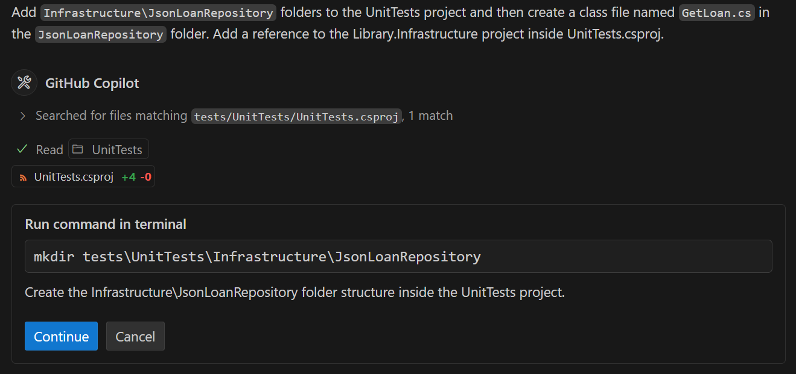
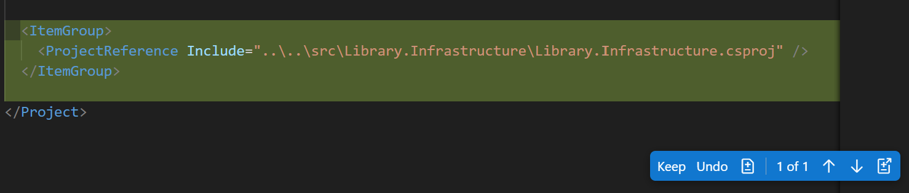

---
lab:
  title: 'Ejercicio: desarrollo de pruebas unitarias mediante GitHub Copilot'
  description: Obtenga información sobre cómo acelerar el desarrollo de pruebas unitarias mediante GitHub en Visual Studio Code.
---

# Desarrollo de pruebas unitarias mediante GitHub Copilot

Los modelos de lenguaje grande detrás de GitHub Copilot se entrenan en una variedad de marcos de pruebas de código y escenarios. GitHub Copilot es una excelente herramienta para generar casos de prueba, métodos de prueba, aserciones de prueba y simulacros, y datos de prueba. En este ejercicio, usará GitHub Copilot para acelerar el desarrollo de pruebas unitarias para una aplicación de C#.

Este ejercicio debe tardar aproximadamente **25** minutos en completarse.

> **IMPORTANTE**: Para completar este ejercicio, debe proporcionar su propia cuenta de GitHub y suscripción de GitHub Copilot. Si no tiene una cuenta de GitHub, puede <a href="https://github.com/" target="_blank">registrarse</a> para obtener una cuenta individual gratuita y usar un plan gratuito de GitHub Copilot para completar el ejercicio. Si tiene acceso a una suscripción de GitHub Copilot Pro, GitHub Copilot Pro+, GitHub Copilot Business o GitHub Copilot Enterprise desde el entorno de laboratorio, puede usar la suscripción de GitHub Copilot existente para completar este ejercicio.

## Antes de comenzar

El entorno de laboratorio debe incluir lo siguiente: Git 2.48 o posterior, SDK de .NET 9.0 o posterior, Visual Studio Code con la extensión Kit de desarrollo de C# y acceso a una cuenta de GitHub con GitHub Copilot habilitado.

Si usa un equipo local como entorno de laboratorio para este ejercicio:

- Para obtener ayuda a fin de configurar el equipo local como entorno de laboratorio, abra el siguiente vínculo en un explorador: <a href="https://go.microsoft.com/fwlink/?linkid=2320147" target="_blank">Configure los recursos de entorno de laboratorio</a>.

- Para obtener ayuda a fin de habilitar la suscripción de GitHub Copilot en Visual Studio Code, abra el siguiente vínculo en un explorador: <a href="https://go.microsoft.com/fwlink/?linkid=2320158" target="_blank">Habilitación de GitHub Copilot en Visual Studio Code</a>.

Si usa un entorno de laboratorio hospedado para este ejercicio:

- Para obtener ayuda a fin de habilitar la suscripción de GitHub Copilot en Visual Studio Code, pegue la siguiente dirección URL en la barra de navegación del sitio de un explorador: <a href="https://go.microsoft.com/fwlink/?linkid=2320158" target="_blank">Habilitación de GitHub Copilot en Visual Studio Code</a>.

- Para asegurarse de que el SDK de .NET está configurado para usar el repositorio oficial de NuGet.org como origen para descargar y restaurar paquetes:

    Abra un terminal de comandos y luego ejecute los siguientes comandos:

    ```bash

    dotnet nuget add source https://api.nuget.org/v3/index.json -n nuget.org

    ```

## Escenario del ejercicio

Es un desarrollador que trabaja en el departamento de TI de la comunidad local. Los sistemas de back-end que admiten la biblioteca pública se han perdido en un incendio. El equipo debe desarrollar una solución temporal para ayudar al personal de la biblioteca a administrar sus operaciones hasta que se pueda reemplazar el sistema. El equipo ha elegido GitHub Copilot para acelerar el proceso de desarrollo.

Tiene una versión inicial de la aplicación de biblioteca que incluye un proyecto de prueba unitaria denominado UnitTests. Debe acelerar el desarrollo de pruebas unitarias adicionales mediante GitHub Copilot.

Este ejercicio incluye las siguientes tareas:

1. Configurar la aplicación de biblioteca en Visual Studio Code.

1. Examine el enfoque de las pruebas unitarias implementadas por el proyecto UnitTests.

1. Amplíe el proyecto UnitTests para empezar a probar las clases de acceso a datos en el proyecto de Library.Infrastructure.

## Configurar la aplicación de biblioteca en Visual Studio Code

Debe descargar la aplicación existente, extraer los archivos de código y, después, abrir la solución en Visual Studio Code.

Siga estos pasos para configurar la aplicación de la biblioteca:

1. Abra una ventana del explorador en el entorno de laboratorio.

1. Para descargar un archivo ZIP con la aplicación de biblioteca, pegue la siguiente dirección URL en la barra de direcciones del explorador: [Laboratorio de GitHub Copilot: desarrollo de pruebas unitarias](https://github.com/MicrosoftLearning/mslearn-github-copilot-dev/raw/refs/heads/main/DownloadableCodeProjects/Downloads/AZ2007LabAppM4.zip)

    El archivo ZIP se denomina **AZ2007LabAppM4.zip**.

1. Extraiga los archivos del archivo **AZ2007LabAppM4.zip**.

    Por ejemplo:

    1. Vaya a la carpeta de descargas del entorno de laboratorio.

    1. Haga clic con el botón derecho en **AZ2007LabAppM4.zip** y seleccione **Extraer todo**.

    1. Seleccione **Mostrar los archivos extraídos al completar** y, a continuación, **Extraer**.

1. Abra la carpeta de archivos extraídos y, después, copie la carpeta **AccelerateDevGHCopilot** en una ubicación que sea fácil de acceder, como la carpeta Escritorio de Windows.

1. Abra la carpeta **AccelerateDevGHCopilot** en Visual Studio Code.

    Por ejemplo:

    1. Abra Visual Studio Code en el entorno de laboratorio.

    1. En Visual Studio Code, en el menú **Archivo**, seleccione **Abrir archivo**.

    1. Vaya a la carpeta Escritorio de Windows, seleccione **AccelerateDevGHCopilot** y luego **Seleccionar carpeta**.

1. En la vista EXPLORADOR DE SOLUCIONES de Visual Studio Code, compruebe la siguiente estructura de soluciones:

    - AccelerateDevGHCopilot\
        - src\
            - Library.ApplicationCore\
            - Library.Console\
            - Library.Infrastructure\
        - tests\
            - UnitTests\

1. Asegúrese de que la solución se compila correctamente.

    Por ejemplo, en la vista EXPLORADOR DE SOLUCIONES, haga clic con el botón derecho en **AccelerateDevGHCopilot**y, después, seleccione **Compilar**.

    Verá varias Advertencias, pero no debería haber ningún Errores.

## Examen del enfoque de las pruebas unitarias implementadas por el proyecto UnitTests

En esta sección del ejercicio, usará GitHub Copilot para examinar el enfoque de pruebas unitarias implementado por el proyecto UnitTests.

Completa los siguientes pasos para usar esta sección del ejercicio:

1. Expanda el proyecto **UnitTests** en la vista EXPLORADOR DE SOLUCIONES.

    El código base existente incluye un proyecto UnitTests que implementa la siguiente estructura de carpetas:

    - UnitTests\
      - ApplicationCore\
        - LoanService\
          - **ExtendLoan.cs**
          - **ReturnLoan.cs**
        - PatronService\
          - **RenewMembership.cs**
      - LoanFactory.cs
      - PatronFactory.cs

    La estructura del proyecto de prueba refleja y admite la parte de **Servicios** del proyecto de **ApplicationCore**.

    - ApplicationCore\
      - Services\
        - LoanService.cs: Contiene los métodos **ExtendLoan** y **ReturnLoan**.
        - PatronService.cs: Contiene el método **RenewMembership**.

1. Abra la vista Chat.

1. Agregue los siguientes archivos al contexto de chat:

    (en el proyecto Library.ApplicationCore)

    - LoanService.cs
    - PatronService.cs

    (en el proyecto UnitTests)

    - ExtendLoan.cs
    - ReturnLoan.cs
    - RenewMembership.cs
    - LoanFactory.cs
    - PatronFactory.cs

1. Para obtener información sobre el proyecto de prueba unitaria existente, escriba la siguiente indicación:

    ```plaintext
    @workspace Explain the approach to unit testing that's been implemented in this workspace.
    ```

    Este mensaje pide a GitHub Copilot que explique el enfoque de las pruebas unitarias en el contexto del área de trabajo. Agregar archivos relevantes al contexto de chat mejora la respuesta.

1. Dedique un minuto a revisar las respuestas de GitHub Copilot.

    Debería ver una descripción similar al ejemplo siguiente:

    ```markdown

    The unit testing approach in this workspace follows a structured and comprehensive methodology to ensure the correctness of the application's core business logic. Here's an overview of the approach:
    
    1. **Use of Test Factories**
       - Factories like PatronFactory and LoanFactory are used to create test data. These factories provide reusable methods to generate consistent and meaningful test objects, such as patrons with specific membership statuses or loans with different states (e.g., returned, current, expired).
       - This approach reduces boilerplate code in test cases and ensures that test data is consistent across different tests.
    
    2. **Mocking Dependencies**
       - **NSubstitute** is used to mock dependencies like repositories (IPatronRepository, ILoanRepository). This allows tests to isolate the behavior of the services being tested without relying on actual database or external dependencies.
       - Mocked methods are configured to return specific data or simulate certain behaviors, enabling precise control over test scenarios.
    
    3. **Service-Oriented Testing**
       - Unit tests are focused on the core services (PatronService and LoanService), which encapsulate the business logic of the application.
       - Each service method is tested for various scenarios, including success cases, edge cases, and error conditions.
    
    4. **Comprehensive Test Coverage**
       - Tests cover a wide range of scenarios for each service method:
         - **PatronService.RenewMembership:**
           - Success cases (e.g., renewing with or without loans, expired membership).
           - Failure cases (e.g., patron not found, too early to renew, overdue loans).
         - **LoanService.ReturnLoan:**
           - Success cases (e.g., returning a loan with valid conditions).
           - Failure cases (e.g., loan not found, already returned).
         - **LoanService.ExtendLoan:**
           - Success cases (e.g., extending a valid loan).
           - Failure cases (e.g., loan not found, membership expired, loan already returned or expired).
       - This ensures that all possible paths in the business logic are tested.
    
    5. **Assertions for Expected Behavior**
       - Each test uses assertions to validate the expected outcomes:
         - **Return values**: Ensuring the correct status is returned (e.g., MembershipRenewalStatus.Success, LoanReturnStatus.LoanNotFound).
         - **State changes**: Verifying that object properties (e.g., MembershipEnd, ReturnDate, DueDate) are updated correctly.
         - **Error handling**: Ensuring exceptions or errors are handled gracefully.
    
    6. **Descriptive Test Names**
       - Test methods use descriptive names and Fact attributes with DisplayName to clearly indicate the scenario being tested. This improves readability and makes it easier to understand the purpose of each test.
    
    7. **Focus on Business Logic**
       - Tests are designed to validate the business rules implemented in the services, such as:
         - Not allowing membership renewal if it's too early or if there are overdue loans.
         - Preventing loan extensions for expired memberships or already returned loans.
       - This ensures that the core functionality of the application behaves as expected under various conditions.
    
    8. **Error Simulation**
       - Tests simulate error scenarios, such as repository methods returning null or throwing exceptions, to verify that the services handle these cases appropriately.
    
    9. **Constants for Configurable Logic**
       - Constants like LoanService.ExtendByDays are used in the logic and verified in tests to ensure consistency and maintainability.
    
    **Summary**
    This workspace implements a robust unit testing strategy by leveraging test factories, mocking, and comprehensive test coverage. The focus is on isolating and validating the business logic of core services, ensuring that all possible scenarios are accounted for. This approach enhances the reliability and maintainability of the application.

    ```

1. Para analizar las ventajas del enfoque actual, escriba el siguiente mensaje:

    ```plaintext
    @workspace What are the benefits of this approach to unit testing?
    ```

1. Dedique un minuto a revisar las respuestas de GitHub Copilot.

    Puede continuar la conversación y pedir más detalles sobre los aspectos específicos del enfoque de pruebas unitarias. Por ejemplo, puede consultar las ventajas de usar factorías de prueba, simular dependencias o la estructura general de las pruebas.

1. Dedique un minuto a tener en cuenta cómo ampliaría el enfoque existente para probar el proyecto Library.Infrastructure.

    El proyecto Library.Infrastructure contiene clases de acceso a datos que interactúan con el sistema de archivos para cargar y guardar datos.

1. Agregue los siguientes archivos al contexto de chat:

    (en el proyecto Library.ApplicationCore)

    - LoanService.cs
    - PatronService.cs

    (en el proyecto UnitTests)

    - ExtendLoan.cs
    - ReturnLoan.cs
    - RenewMembership.cs
    - LoanFactory.cs
    - PatronFactory.cs

1. Para pedir ayuda a GitHub Copilot para ampliar el proyecto UnitTests, escriba el siguiente mensaje:

    ```plaintext
    @workspace How can I extend the `UnitTests` project to begin testing methods in the `Library.Infrastructure` project? Provide a process overview.
    ```

    Esta indicación pide a GitHub Copilot que proporcione una información general sobre el proceso de ampliación del proyecto UnitTests para comenzar a probar métodos en el proyecto Library.Infrastructure. En el mensaje se incluyen varios archivos para proporcionar contexto para la respuesta.

1. Dedique un minuto a revisar la respuesta de GitHub Copilot.

    Debería ver una explicación similar al ejemplo siguiente:

    ```markdown

    1. Add Project Reference:

      - Open the UnitTests.csproj file located at tests/UnitTests/UnitTests.csproj.
      - Add a reference to the Library.Infrastructure project.

    2. Identify methods to test:

      - Identify the methods in the **Library.Infrastructure** project that need to be tested. For example, if you want to test the **LoanService** class, identify the methods in the **LoanService** class that need to be tested.

    3. Create Test Classes:

      - Create new test classes in the **tests/UnitTests** directory to test the methods in the **Library.Infrastructure** project. For example, if you want to test **LoanService**, create a file named **LoanServiceTests.cs**.

    4. Write Unit Tests:

      - In the newly created test classes, write unit tests for the methods in the **Library.Infrastructure** project. Use the xUnit framework for writing tests and NSubstitute for mocking dependencies.

    5. Run Tests:

      - Use Visual Studio Code's integrated terminal or the Test Explorer to run the tests.
      - Ensure that the tests are discovered and executed correctly.

    ```

    > **SUGERENCIA**: Use el modo **Preguntar** de GitHub Copilot para investigar el enfoque de las pruebas. Use las respuestas para planear, desarrollar o ampliar las pruebas unitarias.

## Ampliar el proyecto UnitTests para empezar a probar las clases de acceso a datos

El proyecto **Library.Infrastructure** contiene clases de acceso a datos que interactúan con el sistema de archivos para cargar y guardar datos. El proyecto incluye las siguientes clases:

- JsonData: clase que carga y guarda datos JSON.
- JsonLoanRepository: clase que implementa la interfaz ILoanRepository y usa la clase JsonData para cargar y ahorrar datos de préstamo.
- JsonPatronRepository: clase que implementa la interfaz IPatronRepository y usa la clase JsonData para cargar y guardar los datos de patrón.

### Uso del modo agente para crear una nueva clase de prueba

Puede usar el modo agente de la vista chat cuando tenga una tarea específica en mente y desea permitir que Copilot edite el código de forma autónoma. Por ejemplo, puede usar el modo agente para crear y editar archivos, o para invocar herramientas para realizar tareas. En el modo agente, GitHub Copilot puede planear de forma autónoma el trabajo necesario y determinar los archivos y el contexto pertinentes. A continuación, realiza modificaciones en el código base e invoca herramientas para realizar la solicitud realizada.

> **NOTA**: El modo Agente solo está disponible en Visual Studio Code. Si usa GitHub Copilot en un entorno diferente, puede usar el modo Chat para realizar tareas similares.

En esta sección del ejercicio, usará el modo agente de GitHub Copilot para crear una nueva clase de prueba para el método GetLoan de la clase JsonLoanRepository.

Completa los siguientes pasos para usar esta sección del ejercicio:

1. En la vista Chat, seleccione el botón **Establecer modo** y, a continuación, seleccione **Agente**.

    > **IMPORTANTE**: Cuando se usa la vista Chat en modo de agente, GitHub Copilot puede realizar varias solicitudes Premium para completar una sola tarea. Las solicitudes premium se pueden usar en mensajes iniciados por el usuario y acciones de seguimiento que Copilot realiza en su nombre. El número total de solicitudes premium usadas se basa en la complejidad de la tarea, el número de pasos implicados y el modelo seleccionado.

1. Para iniciar una tarea automatizada que crea una clase de prueba para el método JsonLoanRepository.GetLoan, escriba la indicación siguiente:

    ```plaintext

    Add `Infrastructure\JsonLoanRepository` folders to the UnitTests project. Create a class file named `GetLoan.cs` in the `JsonLoanRepository` folder and create a stub class named `GetLoan`. Add a reference to the Library.Infrastructure project inside UnitTests.csproj.

    ```

    Este mensaje pide a GitHub Copilot que cree una nueva estructura de carpetas y un archivo de clase en el proyecto UnitTests.

    - UnitTests\
      - Infrastructure\
        - JsonLoanRepository\
          - GetLoan.cs

    El mensaje también pide a GitHub Copilot que agregue una referencia al proyecto Library.Infrastructure dentro del archivo UnitTests.csproj.

1. Dedique un minuto a revisar la respuesta de GitHub Copilot.

    Observe las siguientes actualizaciones en la vista chat y el editor de código:

    - El agente muestra los mensajes de estado a medida que completa las tareas solicitadas. La primera tarea será crear la estructura de carpetas en el proyecto UnitTests. El agente puede pausar y pedirle confirmación antes de crear la estructura de carpetas.

        

    - El archivo UnitTests.csproj está abierto en el editor de código con ediciones similares a la siguiente actualización:

        

1. Si el agente pausa la tarea y le pide permiso para ejecutar un comando make directory en el terminal, seleccione **Continuar**.

    Al seleccionar **Continuar**, GitHub Copilot completa las siguientes acciones:

    - Ejecuta el comando mkdir en el terminal para crear las carpetas **Infrastructure\JsonLoanRepository** en el proyecto UnitTests.
    - Crea un nuevo archivo denominado **GetLoan.cs** en la carpeta **JsonLoanRepository**.

1. Dedique un momento a revisar las actualizaciones.

    Debería ver las siguientes actualizaciones en el editor:

    - El proyecto **UnitTests** ahora incluye una referencia a **Library.Infrastructure.csproj**.
    - El archivo **GetLoan.cs** se crea en la carpeta **Infrastructure\JsonLoanRepository**.

1. En la vista Chat, para aceptar todos los cambios, seleccione **Mantener**.

1. En la vista EXPLORADOR DE SOLUCIONES, expanda la estructura de la carpeta **Infrastructure\JsonLoanRepository**.

    Debería ver la siguiente estructura de carpetas:

    - UnitTests\
      - Infrastructure\
        - JsonLoanRepository\
          - GetLoan.cs

### Usar el modo Edición para crear pruebas unitarias para el método GetLoan

En esta sección del ejercicio, usará el modo Edición de GitHub Copilot para crear pruebas unitarias para el método **GetLoan** en la clase **JsonLoanRepository**.

Completa los siguientes pasos para usar esta sección del ejercicio:

1. En la vista Chat, seleccione el botón **Establecer modo** y, a continuación, seleccione **Editar**.

    Use el modo Edición para actualizar los archivos seleccionados. Las respuestas se muestran como sugerencias de código en el editor de código.

1. Abre el archivo **JsonLoanRepository.cs**.

    **JsonLoanRepository.cs** se encuentra en la carpeta **src/Library.Infrastructure/Data/**.

1. Dedica un minuto a revisar el archivo **JsonLoanRepository.cs**.

    ```csharp
    using Library.ApplicationCore;
    using Library.ApplicationCore.Entities;
    
    namespace Library.Infrastructure.Data;
    
    public class JsonLoanRepository : ILoanRepository
    {
        private readonly JsonData _jsonData;
    
        public JsonLoanRepository(JsonData jsonData)
        {
            _jsonData = jsonData;
        }
    
        public async Task<Loan?> GetLoan(int id)
        {
            await _jsonData.EnsureDataLoaded();
    
            foreach (Loan loan in _jsonData.Loans!)
            {
                if (loan.Id == id)
                {
                    Loan populated = _jsonData.GetPopulatedLoan(loan);
                    return populated;
                }
            }
            return null;
        }
    
        public async Task UpdateLoan(Loan loan)
        {
            Loan? existingLoan = null;
            foreach (Loan l in _jsonData.Loans!)
            {
                if (l.Id == loan.Id)
                {
                    existingLoan = l;
                    break;
                }
            }
    
            if (existingLoan != null)
            {
                existingLoan.BookItemId = loan.BookItemId;
                existingLoan.PatronId = loan.PatronId;
                existingLoan.LoanDate = loan.LoanDate;
                existingLoan.DueDate = loan.DueDate;
                existingLoan.ReturnDate = loan.ReturnDate;
    
                await _jsonData.SaveLoans(_jsonData.Loans!);
    
                await _jsonData.LoadData();
            }
        }
    }
    ```

1. Observa los siguientes detalles sobre la clase **JsonLoanRepository**:

    - La clase **JsonLoanRepository** contiene dos métodos: **GetLoan** y **UpdateLoan**.
    - La clase **JsonLoanRepository** usa un objeto **JsonData** para cargar y guardar datos de préstamos.

1. Dedique un minuto a tener en cuenta los requisitos de campo y constructor de la clase de prueba **GetLoan**.

    El método **JsonLoanRepository.GetLoan** recibe un parámetro de Id. de préstamo cuando se llama. El método usa **_jsonData.EnsureDataLoaded** para obtener los últimos datos JSON, y **_jsonData.Loans** para buscar un préstamo coincidente. Si el método encuentra un Id. de préstamo coincidente, devuelve un objeto de préstamo rellenado (**rellenado**). Si el método no puede encontrar un Id. de préstamo que coincida, devuelve **nulo**.

    Para las pruebas unitarias GetLoan:

    - Puedes usar un objeto de repositorio de préstamo ficticio (**_mockLoanRepository**) para ayudar a probar el caso en el que se encuentra un Id. coincidente. Cargue el simulacro con el identificador que desea encontrar. La clase **ReturnLoanTest** muestra cómo simular la interfaz **ILoanRepository** y crear instancias de un objeto de repositorio de préstamo ficticio.

    - Puedes usar un objeto de repositorio de préstamos no ficticios (**_jsonLoanRepository**) para probar el caso en el que no se encuentra ningún Id. coincidente. Solo tiene que especificar un identificador de préstamo que sepa que no está en el archivo (nada más de 100 debería funcionar).

    - Necesitarás un objeto **JsonData** para crear un objeto **JsonLoanRepository** no ficticio. Dado que el proyecto **UnitTests** no tiene acceso al objeto **JsonData** creado por el proyecto **ConsoleApp**, deberás crear uno mediante la interfaz **IConfiguration**.

1. Abra el archivo de prueba GetLoan.cs y seleccione la clase GetLoan.

1. Agregue los siguientes archivos al contexto de chat:

    (en el proyecto Library.ApplicationCore)

    - LoanService.cs

    (en el proyecto Library.Infrastructure)

    - JsonData.cs
    - JsonLoanRepository.cs

    (en el proyecto UnitTests)

    - ReturnLoan.cs
    - LoanFactory.cs

1. Escriba lo siguiente:

    ```plaintext

    #codebase Create fields and a class constructor for the `GetLoan.cs` file. The class will be used to create unit tests for the GetLoan method in the `JsonLoanRepository.cs` file. Create the following private readonly fields: `_mockLoanRepository`, `_jsonLoanRepository`, `_configuration`, and `_jsonData`. Instantiate the fields in the `GetLoanTest` constructor. Use `ConfigurationBuilder` to create a `_configuration` object that can be used to instantiate the JsonData object.

    ```

    Este mensaje pide a GitHub Copilot que sugiera campos y un constructor de clase.

1. Dedique un minuto a revisar la respuesta de GitHub Copilot.

    Es posible que vea una sugerencia de código similar al siguiente fragmento de código:

    ```csharp
    using NSubstitute;
    using Library.ApplicationCore;
    using Library.ApplicationCore.Entities;
    using Library.ApplicationCore.Interfaces;
    using Library.Infrastructure.Data;
    using Microsoft.Extensions.Configuration;
    
    namespace UnitTests.Infrastructure.JsonLoanRepository;
    
    public class GetLoanTest
    {
        private readonly ILoanRepository _mockLoanRepository;
        private readonly JsonLoanRepository _jsonLoanRepository;
        private readonly IConfiguration _configuration;
        private readonly JsonData _jsonData;
    
        public GetLoanTest()
        {
            _mockLoanRepository = Substitute.For<ILoanRepository>();
            _configuration = new ConfigurationBuilder()
                .AddJsonFile("appsettings.json")
                .Build();
            _jsonData = new JsonData(_configuration);
            _jsonLoanRepository = new JsonLoanRepository(_jsonData);
        }
    
        // Add test methods here
    }
    ```

1. En la vista Chat, para aceptar todas las actualizaciones, seleccione **Mantener**.

1. Después de aceptar las actualizaciones, compruebe si existen los siguientes problemas:

    > **NOTA**: El código de ejemplo del paso siguiente muestra las actualizaciones que corrigen los siguientes problemas:
  
    - Si hay un conflicto entre el espacio de nombres **UnitTests.Infrastructure.JsonLoanRepository** y el tipo **JsonLoanRepository** especificado en el código, debe actualizar el espacio de nombres en GetLoans.cs para eliminar el conflicto. Siga el patrón usado en los archivos **ReturnLoan.cs** y **RenewMembership.cs**.

    - Si **ILoanRepository** no se reconoce en el código, es posible que tengas que agregar una directiva **using** para **Library.ApplicationCore** a la parte superior del archivo.

    - Si el objeto **_configuration** no se crea una instancia correctamente, es posible que debas actualizar la línea de código que contiene **ConfigurationBuilder**. Puedes simplificar el código para usar **_configuration = new ConfigurationBuilder(). Build();**.

    - Si GitHub Copilot sugiere un **uso de Library.ApplicationCore.Interfaces**, puedes eliminarlo de la parte superior del archivo.

1. Actualice el archivo **GetLoan.cs** para solucionar los problemas que identificó en el paso anterior.

    Puede usar el siguiente fragmento de código como referencia:

    ```csharp
    using NSubstitute;
    using Library.ApplicationCore;
    using Library.ApplicationCore.Entities;
    using Library.Infrastructure.Data;
    using Microsoft.Extensions.Configuration;
    
    namespace UnitTests.Infrastructure.JsonLoanRepositoryTests;
    
    public class GetLoanTest
    {
        private readonly ILoanRepository _mockLoanRepository;
        private readonly JsonLoanRepository _jsonLoanRepository;
        private readonly IConfiguration _configuration;
        private readonly JsonData _jsonData;
    
        public GetLoanTest()
        {
            _mockLoanRepository = Substitute.For<ILoanRepository>();
            _configuration = new ConfigurationBuilder().Build();
            _jsonData = new JsonData(_configuration);
            _jsonLoanRepository = new JsonLoanRepository(_jsonData);
        }
    
    }
    ```

1. Agregue los siguientes archivos al contexto de chat:

    (en el proyecto Library.ApplicationCore)

    - LoanService.cs
    - Loans.json.

    (en el proyecto Library.Infrastructure)

    - JsonData.cs
    - JsonLoanRepository.cs

    (en el proyecto UnitTests)

    - ReturnLoan.cs
    - LoanFactory.cs

1. Selecciona el contenido del archivo **GetLoan.cs** y después introduce la siguiente indicación en la vista Chat:

    ```plaintext
    @workspace Update the selection to include a unit test for the `JsonLoanRepository.GetLoan` method. The unit test should test the case where a loan ID is found in the data. Use `_mockLoanRepository` to arrange the expected return loan. Use `_jsonLoanRepository` to return an actual loan. Asserts should verify that the return loan ID matches the expected loan ID. Use a loan ID that exists in the `Loans.json` file.
    ```

    Esta solicitud pide a GitHub Copilot que sugiera una prueba unitaria para el método **JsonLoanRepository.GetLoan**. La prueba unitaria debe probar el caso en el que se encuentra un identificador de préstamo en los datos. La prueba debe usar **_mockLoanRepository** para organizar el préstamo devuelto esperado, **_jsonLoanRepository** para devolver un préstamo real, y verificar que el Id. del préstamo devuelto coincide con el Id. del préstamo esperado. El Id. del préstamo debe existir en el archivo **Loans.json**.

1. Dedique un minuto a revisar las actualizaciones sugeridas por GitHub Copilot.

    Debería ver una sugerencia de código similar al siguiente fragmento de código:

    ```csharp
    using NSubstitute;
    using Library.ApplicationCore;
    using Library.ApplicationCore.Entities;
    using Library.Infrastructure.Data;
    using Microsoft.Extensions.Configuration;
    using Xunit;
    
    namespace UnitTests.Infrastructure.JsonLoanRepositoryTests;
    
    public class GetLoanTest
    {
        private readonly ILoanRepository _mockLoanRepository;
        private readonly JsonLoanRepository _jsonLoanRepository;
        private readonly IConfiguration _configuration;
        private readonly JsonData _jsonData;
    
        public GetLoanTest()
        {
            _mockLoanRepository = Substitute.For<ILoanRepository>();
            _configuration = new ConfigurationBuilder().Build();
            _jsonData = new JsonData(_configuration);
            _jsonLoanRepository = new JsonLoanRepository(_jsonData);
        }
    
        [Fact(DisplayName = "JsonLoanRepository.GetLoan: Returns loan when loan ID is found")]
        public async Task GetLoan_ReturnsLoanWhenLoanIdIsFound()
        {
            // Arrange
            var loanId = 1; // Use a loan ID that exists in the Loans.json file
            var expectedLoan = new Loan
            {
                Id = loanId,
                BookItemId = 17,
                PatronId = 22,
                LoanDate = DateTime.Parse("2023-12-08T00:40:43.1808862"),
                DueDate = DateTime.Parse("2023-12-22T00:40:43.1808862"),
                ReturnDate = null
            };

            _mockLoanRepository.GetLoan(loanId).Returns(expectedLoan);

            // Act
            var actualLoan = await _jsonLoanRepository.GetLoan(loanId);
    
            // Assert
            Assert.NotNull(actualLoan);
            Assert.Equal(expectedLoan.Id, actualLoan?.Id);
        }
    }
    ```

1. En la vista Chat, para aceptar todas las actualizaciones, seleccione **Mantener**.

    Si la clase **Loan** no se reconoce en tu código, asegúrate de que tienes una instrucción **using Library.ApplicationCore.Entities;** en la parte superior del archivo GetLoan.cs. La clase **Loan** se encuentra en el espacio de nombres **Library.ApplicationCore.Entities**.

1. Compila la solución **AccelerateDevGitHubCopilot** para asegurarte de que no haya errores.

1. Use la característica de autocompletar de GitHub Copilot para crear una prueba para el caso en el que no se encuentra el identificador del préstamo.

    Crea una línea en blanco después del método **GetLoan_ReturnsLoanWhenLoanIdIsFound**.

    Acepte las sugerencias de autocompletar para crear un nuevo método de prueba.

    > **NOTA**: Las finalizaciones de código pueden aparecer una línea a la vez. Es posible que tenga que presionar **Tab** o **Entrar** varias veces para obtener el código de prueba unitaria completado.

1. Dedique un minuto a revisar el nuevo texto de la unidad.

    Debería ver un texto de unidad sugerido similar al siguiente fragmento de código:

    ```csharp

        [Fact(DisplayName = "JsonLoanRepository.GetLoan: Returns null when ID is not found")]
        public async Task GetLoan_ReturnsNullWhenIdIsNotFound()
        {
            // Arrange
            var loanId = 999; // Loan ID that does not exist in Loans.json

            _mockLoanRepository.GetLoan(loanId).Returns((Loan?)null);

            // Act
            var actualLoan = await _jsonLoanRepository.GetLoan(loanId);

            // Assert
            Assert.Null(actualLoan);
        }

    ```

    La característica de autocompletar de GitHub Copilot puede simular un préstamo esperado aunque no sea necesario, por lo que podría obtener el siguiente fragmento de código:

    ```csharp
    [Fact(DisplayName = "JsonLoanRepository.GetLoan: Returns null when loan ID is not found")]
    public async Task GetLoan_ReturnsNullWhenLoanIdIsNotFound()
    {
        // Arrange
        var loanId = 999; // Use a loan ID that does not exist in the Loans.json file
        var expectedLoan = new Loan { Id = loanId, BookItemId = 101, PatronId = 202, LoanDate = DateTime.Now, DueDate = DateTime.Now.AddDays(14) };
        _mockLoanRepository.GetLoan(loanId).Returns(expectedLoan);

        // Act
        var actualLoan = await _jsonLoanRepository.GetLoan(loanId);

        // Assert
        Assert.Null(actualLoan);
    }

    ```

    Puedes eliminar el código que simula un préstamo esperado, pero necesitas un Id. de préstamo que no exista en el archivo **Loans.json**.

    Asegúrese de que la prueba unitaria "Devuelve null cuando no se encuentra el identificador de préstamo" asigna un valor **loanId** que no está en el conjunto de datos.

1. Observe que las pruebas unitarias requieren acceso a los archivos de datos JSON.

    El método **JsonLoanRepository.GetLoan** usa un objeto **JsonData** para cargar y guardar datos de préstamo.

    Los archivos de datos JSON se encuentran en la carpeta **Library.Console\Json**. Es necesario actualizar el archivo **UnitTests.csproj** para incluir estos archivos en el proyecto de prueba.

1. Agrega el siguiente fragmento XML al archivo **UnitTests.csproj**:

    ```xml
    <ItemGroup>
        <None Include="..\..\src\Library.Console\Json\**\*">
            <Link>Json\%(RecursiveDir)%(FileName)%(Extension)</Link>
            <CopyToOutputDirectory>PreserveNewest</CopyToOutputDirectory>
        </None>
    </ItemGroup>
    ```

    Esto garantiza que los archivos de datos JSON se copien en el directorio de salida cuando se ejecuten las pruebas.

## Ejecución de las pruebas unitarias

Hay varias maneras de ejecutar las pruebas unitarias para la clase **JsonLoanRepository**. Puedes usar el Explorador de pruebas de Visual Studio Code, el terminal integrado o el comando **dotnet test**.

Completa los siguientes pasos para usar esta sección del ejercicio:

1. Asegúrese de que tiene abierto el archivo GetLoans.cs en el editor.

1. Compile la solución y asegúrese de que no haya errores.

    Haga clic con el botón derecho en **AccelerateDevGitHubCopilot** y seleccione **Compilar**.

1. Observe el "botón de reproducción verde" a la izquierda de los métodos de prueba.

1. Abra la vista Explorador de pruebas de Visual Studio Code.

    Para abrir la vista Explorador de pruebas, seleccione el icono con forma circular de la barra de actividades de la izquierda. El Explorador de pruebas se etiqueta como "Pruebas" en la interfaz de usuario.

    El Explorador de pruebas es una vista de árbol que muestra todos los casos de prueba del área de trabajo. Puede ejecutar o depurar los casos de prueba y ver los resultados de las pruebas mediante el Explorador de pruebas.

1. Expande **UnitTests** y los nodos subyacentes para buscar **GetLoanTest**.

1. Ejecute el **JsonLoanRepository.GetLoan: Devuelve el préstamo cuando se encuentra el identificador del préstamo** caso de prueba.

1. Observe que los resultados de la prueba se muestran en la vista Explorador de pruebas y en el Editor de código.

    Debería ver una marca de verificación verde que indique la prueba superada.

1. Use el Editor de código para ejecutar el **JsonLoanRepository.GetLoan: Devuelve null cuando no se encuentra la identificación del préstamo ** en caso de prueba.

    Para ejecutar la prueba desde el Editor de código, seleccione el botón de reproducción verde situado a la izquierda del método de prueba.

    Observe que los resultados de la prueba se muestran en la vista Explorador de pruebas y en el Editor de código.

    Asegúrese de que el **JsonLoanRepository.GetLoan: Devuelve null cuando no se encuentra el identificador de préstamo ** superada la prueba. Debería ver una marca de verificación verde a la izquierda de ambas pruebas.

## Resumen

En este ejercicio, ha aprendido a usar GitHub Copilot para acelerar el desarrollo de pruebas unitarias en una aplicación de C#. Ha usado la vista chat de GitHub Copilot en modo Preguntar, modo agente y modo de edición. Ha usado el modo Preguntar para examinar el enfoque de pruebas unitarias existentes, el modo agente para crear carpetas de proyecto y una nueva clase de prueba y el modo Editar para crear pruebas unitarias. También ha usado la característica de finalización de código de GitHub Copilot para crear una prueba unitaria.

## Limpieza

Ahora que ha terminado el ejercicio, dedique un minuto a asegurarse de que no ha realizado cambios en la cuenta de GitHub ni en la suscripción de GitHub Copilot que no quiere conservar. Si ha realizado algún cambio, reviértalos ahora.
